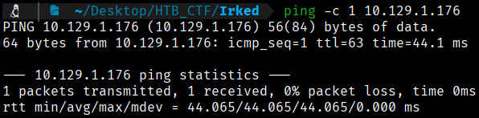
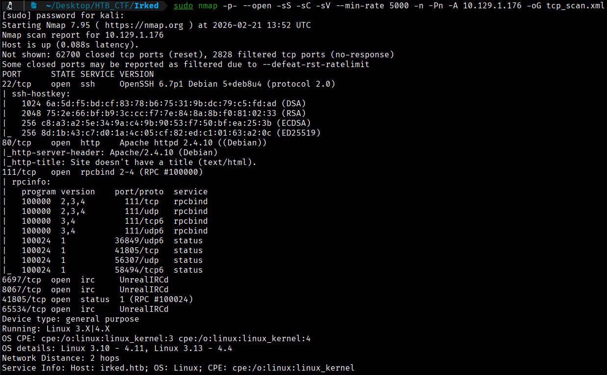
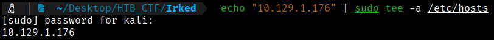
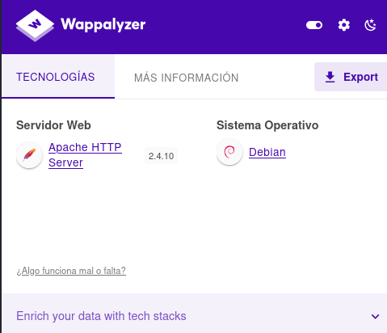
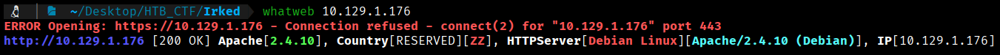
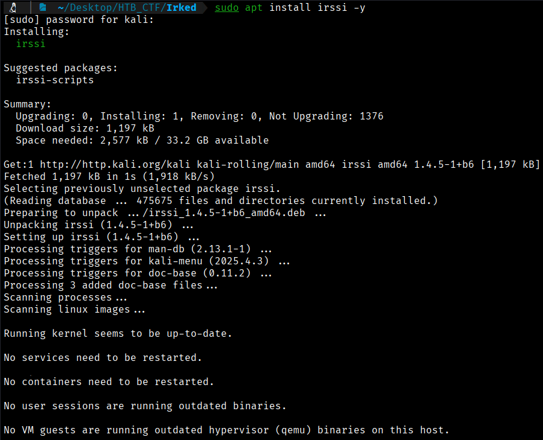
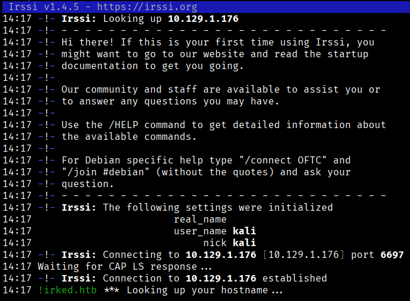
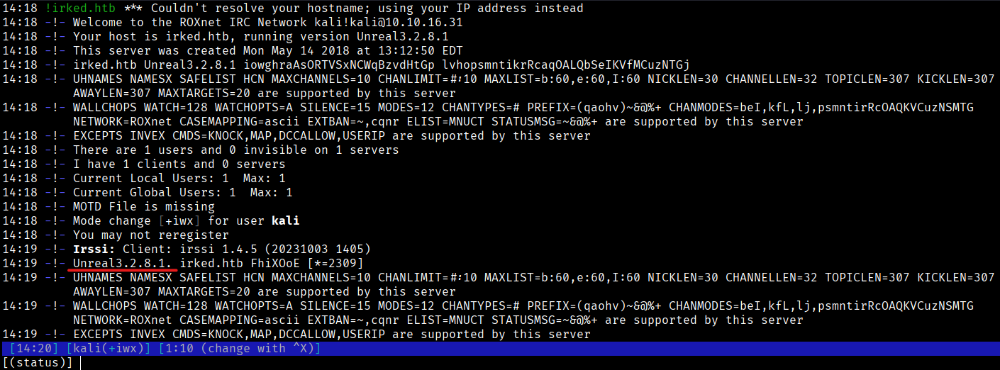
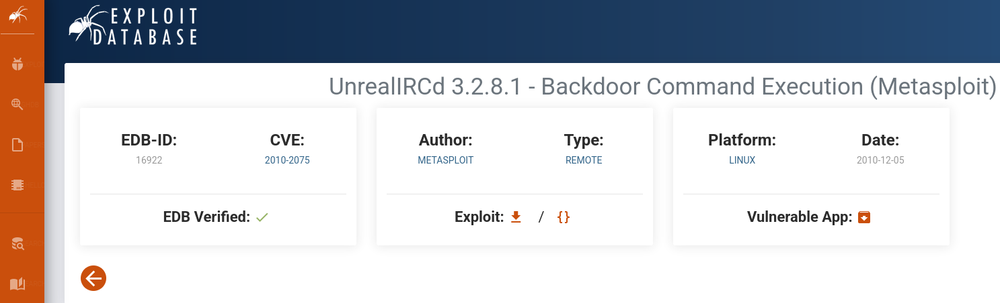

First of all we check that we have connection with IP target.
```bash 
$ ping -c 1 10.129.1.176
```


This TTL value on HTB indicates that is a Linux machine.

We will start with our usual Nmap scan and find the following open ports. 
```bash
$ sudo nmap -p- --open -sS -sC -sV --min-rate 5000 -n -Pn -A 10.129.1.176 -oG tcp_scan.xml
```
-p- → Scans all 65,535 TCP ports, not just the most common ones. All 65,535 TCP ports, not just the most common ones, not just the most common ones. 

--open → Shows only ports that are open, filtering out closed or filtered ones.

-sS → Performs a TCP SYN scan (half-open scan), which is fast and stealthy and requires root privileges.

-sC → Runs default NSE (Nmap Scripting Engine) scripts to gather additional information such as common vulnerabilities and service details.

-sV → Attempts to detect service versions running on open ports.

--min-rate 5000 → Forces Nmap to send at least 5000 packets per second, speeding up the scan but increasing the chance of detection or packet loss. 

-n →  Disables DNS resolution to make the scan faster.

-Pn → Skips host discovery and assumes the target is alive, useful when ICMP is blocked.

-A → Enables aggressive scan options, including OS detection, version detection, script scanning, and traceroute.

-oG → Output option: write results in XML format to file nmap.xml.  Other formats: -oN (normal), -oG (grepable), -oA (all formats).



First of all we will try to open with our browser the IP. To access the website, we must add the IP to our /etc/hosts file to resolve the connection with the IP address.
```bash
$ echo "10.129.1.176" | sudo tee -a /etc/hosts
```


Now we can go to the website through the port 80


When accessing the IP address on port 80 indicated by Nmap, we can observe the following screen displaying the message "IRC is almost working!"

If, while browsing the web, we go to the Wappalyzer application or run a WhatWeb scan in our command-line console, we will see that we do not obtain any additional information beyond what has already been provided by Nmap.
```bash
$ whatweb 10.129.1.176
```




By looking at the message that appears on the website, we are going to check which version of IRCD is running, since Nmap has not provided us with the firewall version

To find out the version of IRCd, we will install irssi.
```bash
$ sudo apt install irssi -y
```



Now we will connect using the following command and ask for the version.
```bash
$ irssi -c 10.129.1.176 -p 6697
```


```bash
$ /version
```



We can see that we are in front of the 3.2.8.1 version. So, we will chek it on google to find if this version have a vulnerability (to close the irrsi connection /quit)



We can see that this version of IRCd has a "Backdoor Command Execution" vulnerability and that it is available in Metasploit.


[Back](README.md)