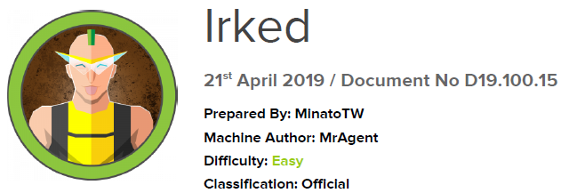

# Scope

Irked is a fairly simple and accessible machine that demands fundamental enumeration techniques. It highlights the importance of performing a full port scan and carefully analyzing any unusual or suspicious binaries discovered during system enumeration.

# Index
- [Enumeration](Enumeration.md)
- [Foothold](Foothold.md)
- [Lateral Movement](Lateral_Movement.md)
- [Priv Escalation](Priv_Escalation.md)

Go back to [Hack-The-Box_CTF](https://github.com/jesuscuenca-cyber/Hack-The-Box_CTF)