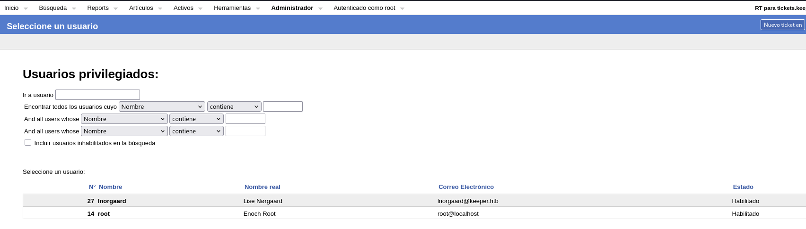
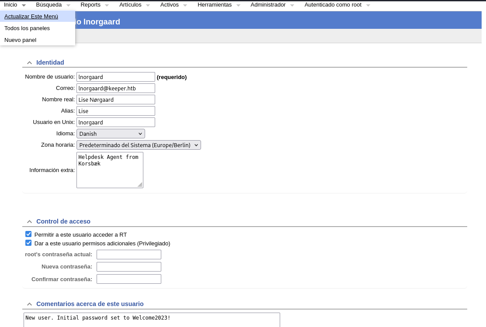
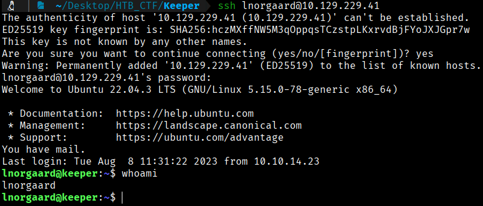
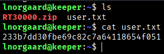

While enumerating the system, within the Admin > Users section, we observe two accounts: lnorgaard and root.



Further inspection of the user lnorgaard reveals the password Welcome2023! listed in the comment section.


```bash
User: lnorgaard
Password: Welcome2023!
```
Logging in via SSH as the user lnorgaard with the discovered password is successful.
```bash
$ ssh lnorgaard@10.129.229.41
```


If we look inside the directory, we find the user flag.


```bash
User Flag → 233b7dd30fbe69c82c7a64118654f051
```


[Back](README.md)