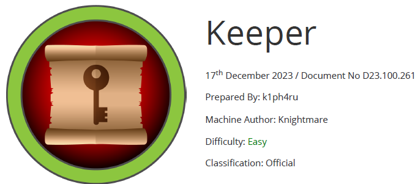

# Scope

**Keeper** is a beginner-friendly Linux target that includes a help desk ticketing platform configured with default login credentials.
After enumerating the exposed services, plaintext credentials can be discovered, allowing successful access via SSH. Once connected over SSH, a KeePass database dump file can be located on the system. This dump can be analyzed to recover the master password.
With the recovered master password, the KeePass vault becomes accessible, revealing the root user's SSH private keys. Using these keys, it is possible to authenticate as root and obtain a fully privileged shell on the machine.

# Index
- [Enumeration](Enumeration.md)
- [Foothold](Foothold.md)
- [Priv Escalation](Priv_Escalation.md)

Go back to [Hack-The-Box_CTF](https://github.com/jesuscuenca-cyber/Hack-The-Box_CTF)