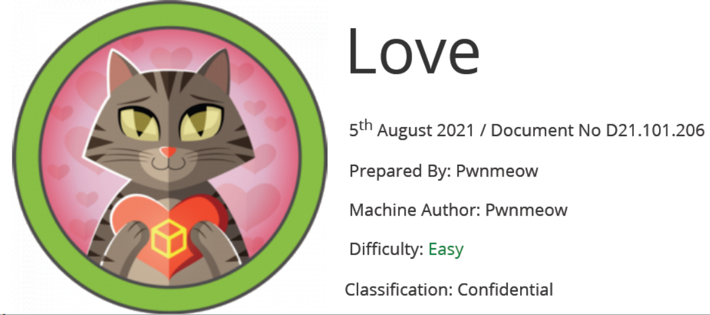

# Scope

Love is a relatively simple Windows machine that includes a voting system application affected by an authenticated remote code execution (RCE) vulnerability. A port scan identifies a service running on port 5000; however, when accessing it through a browser, we find that the resource is restricted.
Additionally, the same server hosts a file scanning application vulnerable to Server-Side Request Forgery (SSRF). Exploiting this flaw allows access to an internal password manager, from which we can retrieve credentials for the voting system.
Using these credentials, we authenticate and execute the RCE attack as the user "phoebe," gaining an initial foothold on the system. Further enumeration of the Windows environment reveals a privilege escalation misconfiguration.
By bypassing AppLocker restrictions, we successfully install a malicious MSI package, ultimately obtaining a reverse shell with SYSTEM-level privileges.

# Index
- [Enumeration](Enumeration.md)
- [Foothold](Foothold.md)
- [Priv Escalation](Priv_Escalation.md)

Go back to [Hack-The-Box_CTF](https://github.com/jesuscuenca-cyber/Hack-The-Box_CTF)