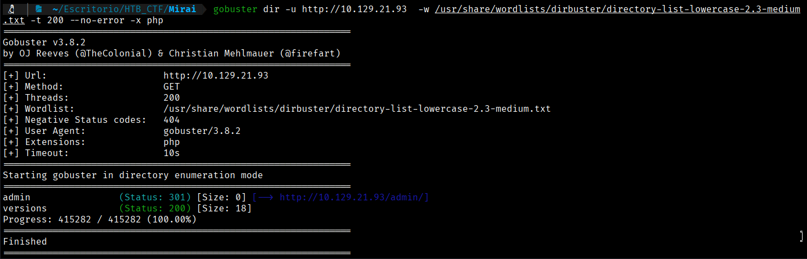
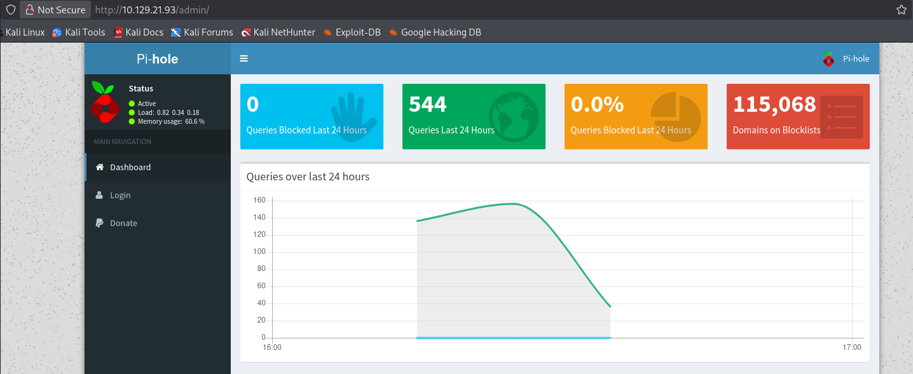
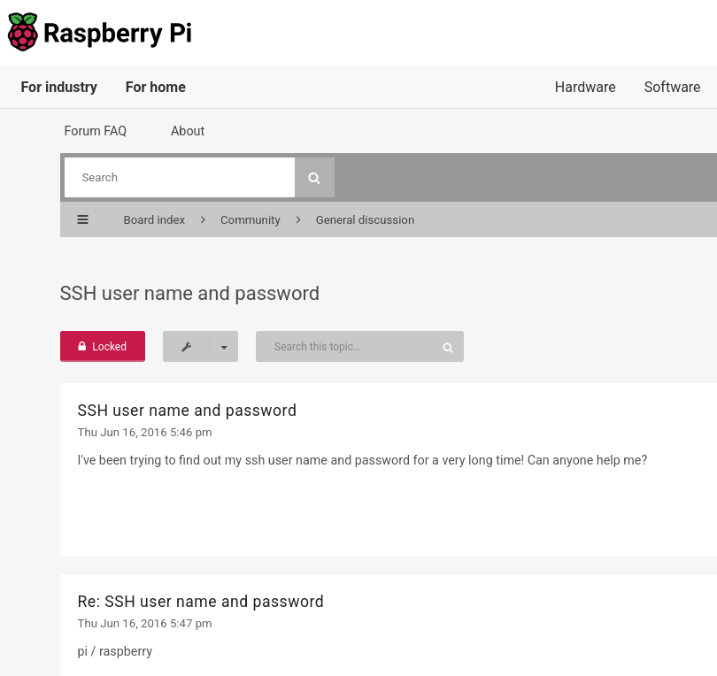
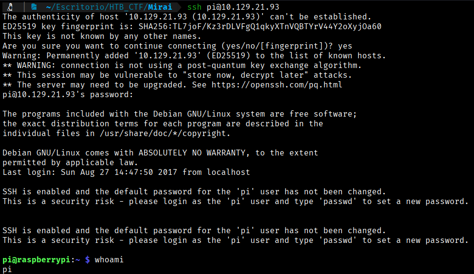
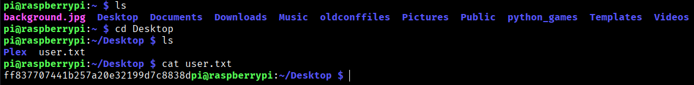

As the website doesn't whow us nothing, we will try to  discober hidden directories. 
The Gobuster tool will allow us to scan for hidden resources such as subdomains, directories, and parameters.
Let's look for hidden subdomains. 
```bash
$ gobuster dir -u http://10.129.21.93  -w /usr/share/wordlists/dirbuster/directory-list-lowercase-2.3-medium.txt -t 200 --no-error -x php
```


So we will check the “admin directory”. When we search in this directory, we will find the “Pi-Hole” webpage.



If we perform a quick search for what "Pi-Hole" is, we find the following:

Pi-hole is a network-wide ad blocker that functions as a DNS sinkhole, intercepting and blocking advertising and tracking domains for all devices connected to a network. It works at the router level, stopping ads from loading in web browsers, mobile applications, and smart TVs. Pi-hole is typically deployed on a low-power device such as a Raspberry Pi.

Based on this, we can perform another search on Google to determine the default SSH credentials, since our Nmap scan indicates that port 22 (SSH) is open. If the credentials have not been changed, this could provide a potential avenue for system exploitation.



We will try to connect via SSH with this credential pi:raspberry
```bash
$ ssh pi@10.129.21.93
```




```bash
User Flag → ff837707441b257a20e32199d7c8838d
```


[Back](README.md)