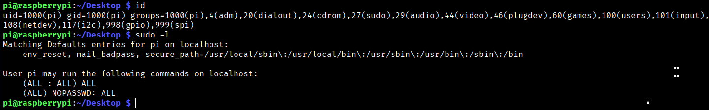
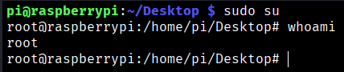
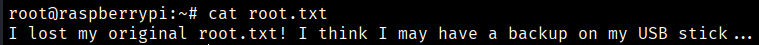
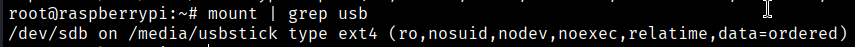
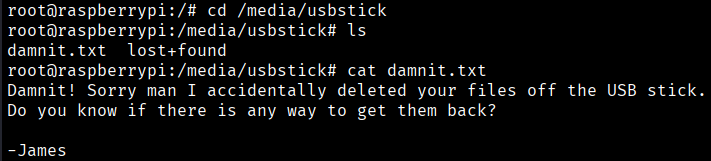
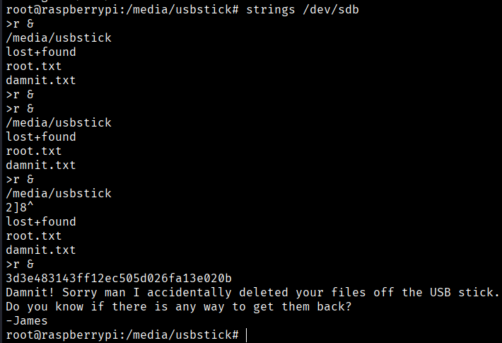

Let's check what permissions we have with the current user.
```bash
$ id
$ sudo -l
```



We can see that the "pi" user belongs to the "sudo" group, and we can also observe that commands can be executed without requiring a password. Therefore, to switch from the "pi" user to "root", we will proceed as follows:
```bash
$ sudo su
```



Now we are “root” users, so we will find the Root Flag in Root directory.



As the message says, the flag is in the USB stick, so we can do this to find a USB stick
```bash
$ mount | grep usb
```



So we will go to this directory
```bash
$ cd /media/usbstick
```



It appears that we did not find the flag here either, as it has been deleted. However, since the file is not truly removed from the system, we can run the following command to list previous activity, and this time we are able to see the flag.
```bash
$ strings /dev/sdb (/deb/sdb is the original direcotry before mount)
```


```bash
Root Flag → 3d3e483143ff12ec505d026fa13e020b
```


[Back](README.md)