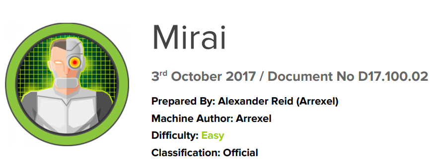

# Scope

Mirai highlights one of the most rapidly expanding attack surfaces in recent years: poorly configured IoT devices. This vulnerability continues to grow as the number of IoT devices being developed and deployed worldwide increases, and it is actively leveraged by numerous botnets. Additionally, internal IoT devices are being utilized by threat actors to maintain long-term persistence within compromised environments.

# Index
- [Enumeration](Enumeration.md)
- [Fuzzing](Fuzzing.md)
- [Priv Escalation](Priv_Escalation.md)

Go back to [Hack-The-Box_CTF](https://github.com/jesuscuenca-cyber/Hack-The-Box_CTF)