First of all we check that we have connection with IP target.
```bash
$ ping -c 1 10.129.230.176
```
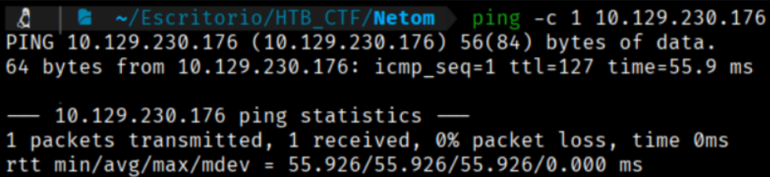

This TTL value on HTB indicates that is a Windows machine.

We will start with our usual Nmap scan and find the following open ports. 
```bash
$ sudo nmap -p- --open -sS -sC -sV --min-rate 5000 -n -Pn -A 10.129.230.176 -oG tcp_scan.xml
```
-p- → Scans all 65,535 TCP ports, not just the most common ones. All 65,535 TCP ports, not just the most common ones, not just the most common ones. 

--open → Shows only ports that are open, filtering out closed or filtered ones.

-sS → Performs a TCP SYN scan (half-open scan), which is fast and stealthy and requires root privileges.

-sC → Runs default NSE (Nmap Scripting Engine) scripts to gather additional information such as common vulnerabilities and service details.

-sV → Attempts to detect service versions running on open ports.

--min-rate 5000 → Forces Nmap to send at least 5000 packets per second, speeding up the scan but increasing the chance of detection or packet loss. 

-n →  Disables DNS resolution to make the scan faster.

-Pn → Skips host discovery and assumes the target is alive, useful when ICMP is blocked.

-A → Enables aggressive scan options, including OS detection, version detection, script scanning, and traceroute.

-oG → Output option: write results in XML format to file nmap.xml.  Other formats: -oN (normal), -oG (grepable), -oA (all formats).

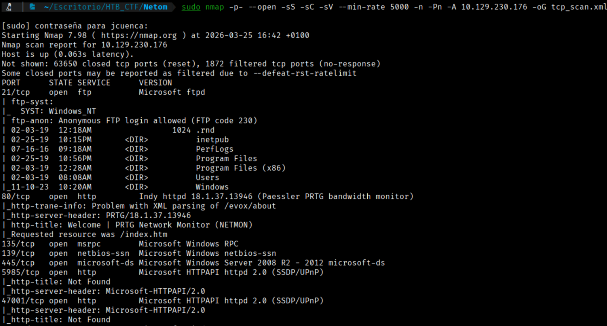

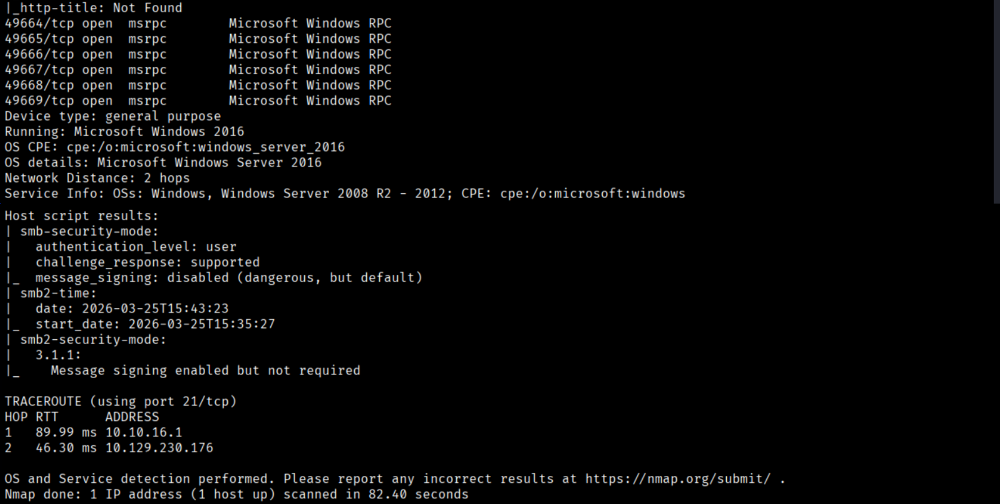

First of all we will try to open with our browser the IP. To access the website, we must add the IP to our /etc/hosts file to resolve the connection with the IP address.
```bash
$ echo "10.129.230.176 Netmon" | sudo tee -a /etc/hosts 
```
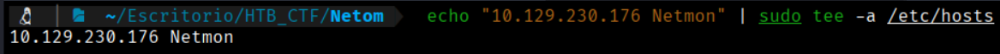

Now we can go to the website through the port 80

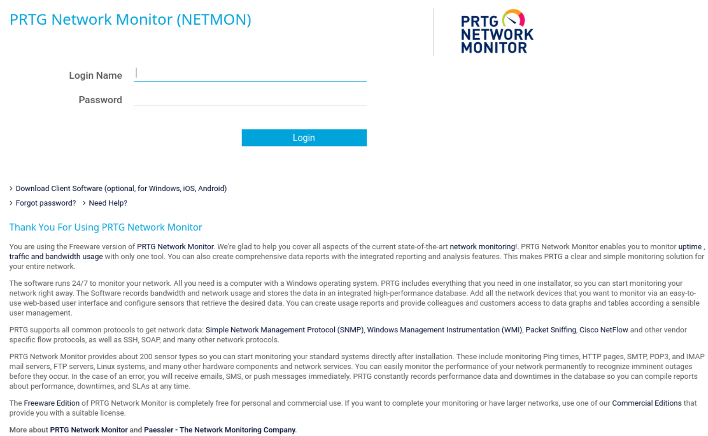

From the Nmap results, we find several open ports such as 80, 21, among others. Focusing on port 21 (FTP), we can see that it allows "Anonymous FTP login," which means we can connect with anonymous:(no pass) credentials. Let's test this.
```bash
$ ftp 10.129.230.176
```
```bash
User: anonymous
Pass: 
```

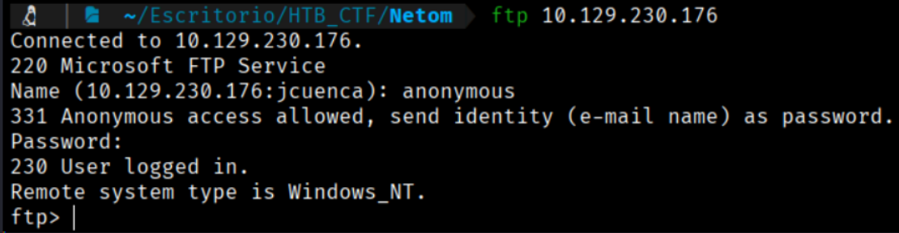

If we navigate within our anonymous FTP session to `Users/Public/Desktop`, we can find the user flag.
To retrieve it, we run `get user.txt`, and it will be downloaded to our current working directory.
```bash
$ get user.txt
```
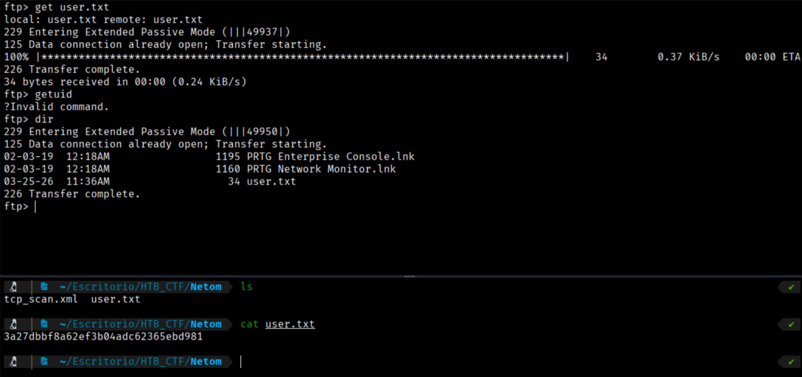
```bash
User Flag → 3a27dbbf8a62ef3b04adc62365ebd981
```

If we now look both at the folder where we found the User Flag and at the website of the IP provided, we observe files that have the same name as the website header: PRTG Network Monitor. Let’s perform a quick Google search to find out what this is.


Seeing this, and knowing that this software is used for network monitoring, let’s check what kind of data it stores. To do this, we refer to the following website: https://helpdesk.paessler.com/en/support/solutions/articles/76000041654-how-and-where-does-prtg-store-its-data

According to the documentation, PRTG stores data in several locations:

- **Program directory**: where the core installation of the software is located.
- **Data directory**: where it stores monitoring configuration, collected monitoring data, logs, reports, and more.
- **Windows registry**: where sensitive information such as the license key, administrator credentials, and IP configuration is stored. 

Within the data directory, PRTG keeps various important files, such as:

- Configuration files (devices, sensors, users, etc.)
- Monitoring data (historical results of sensors)
- Logs (system logs, web server logs, debug logs)
- Databases (logs, tickets, ToDo entries, SNMP traps, syslog messages, etc.)
- Reports and screenshots generated by the system :contentReference[oaicite:1]{index=1}

Additionally, PRTG uses its own built-in database optimized for storing monitoring data efficiently in flat files, allowing fast access and real-time visualization. 

If we check the Program Files and Program Files (x86) directories, we don’t see anything relevant, so from the root we run an `ls -la` to list all hidden directories. Here we find a new directory called ProgramData. 

When we enter it, we see another directory named Paessler, and inside it we finally find PRTG configuration and data files.

At first, we will copy the file **"PRTG Configuration.dat.bak"** to our machine, since the official website does not mention anything about this file.

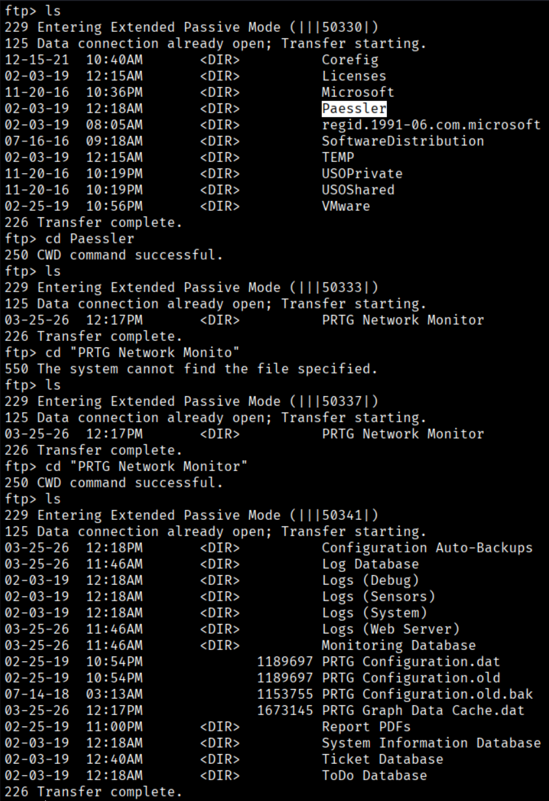
```bash
$ get “PRTG Configuration.old.bak”
```
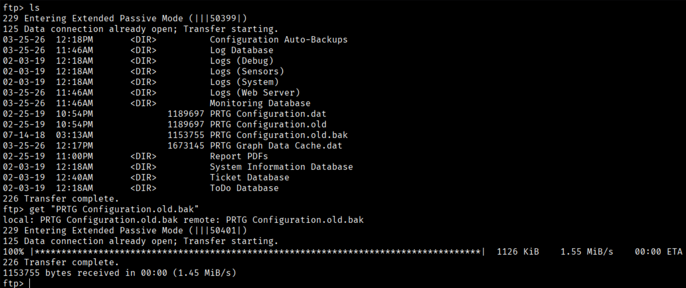

Now, on our machine, we will open the file to see what it contains.

We use **Emacs** so that it is easier to view than directly in the console.
```bash
$ emacs PRTG\ Configuration.old.bak  
```

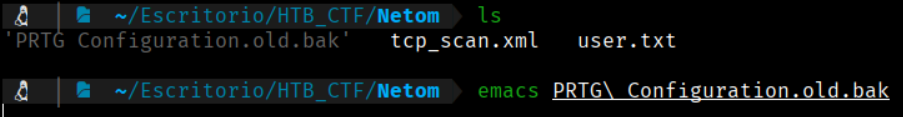

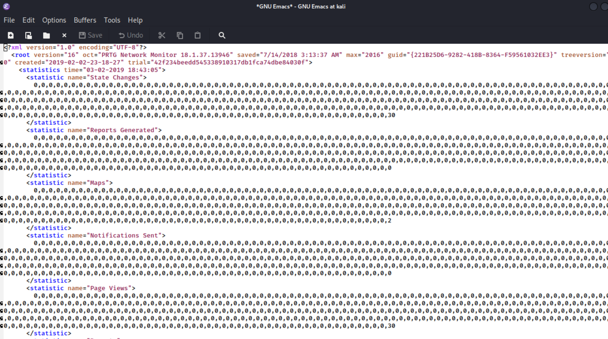

Uponf reviewing the file, we find some **admin credentials**

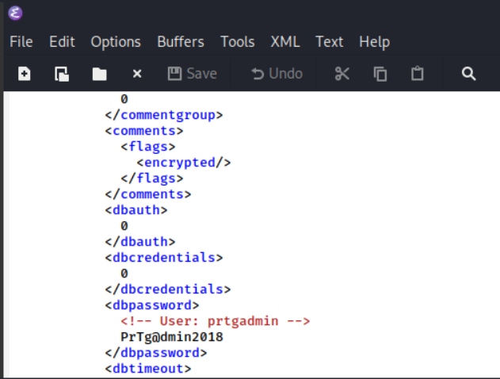
```bash
User: prtgadmin
Pass: PrTg@dmin2018
```
With these credentials, we will open an **FTP session** to see if they work and whether there is any **credential reuse**.

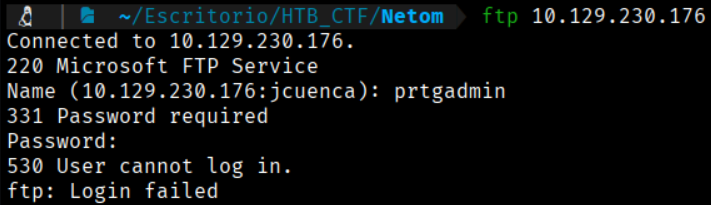

It seems that the credentials **do not work**. So, let's try to the webpage login

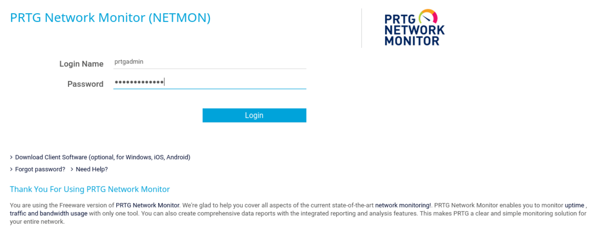

This password doesn’t work, but we can try changing the year, since the copy we extracted is old. We will try the same password ending with **2019**.

Now we are in with the credentiasl prtgadmin:PrTg@dmin2019

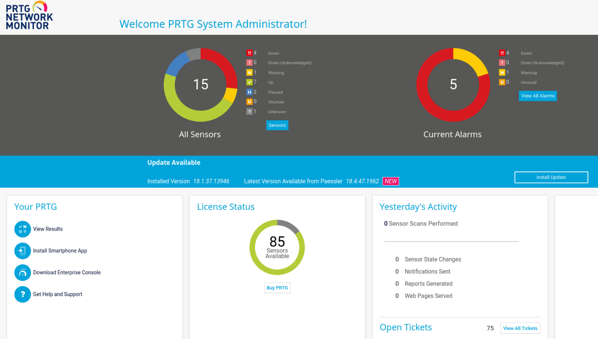


[Back](README.md)