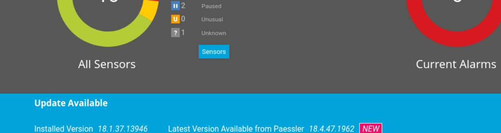
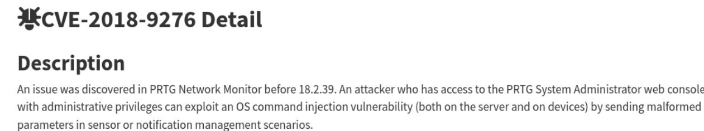
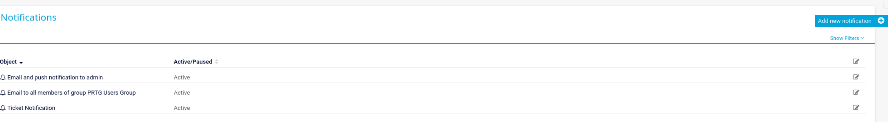
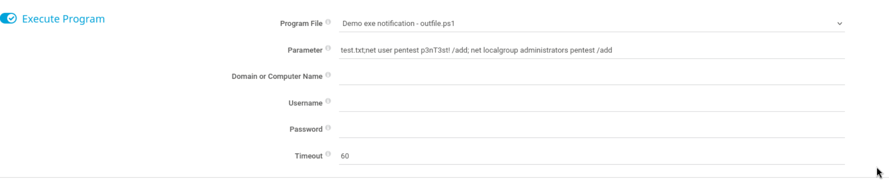
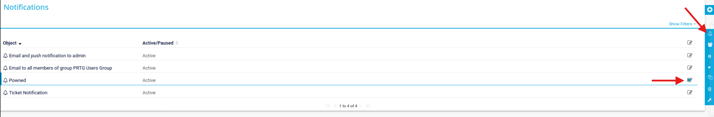
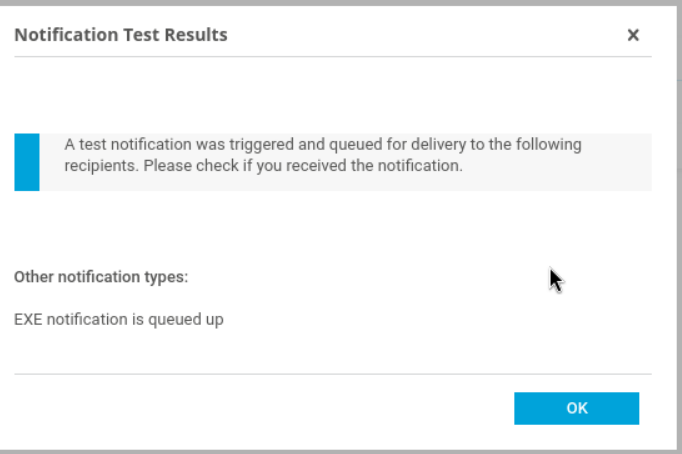
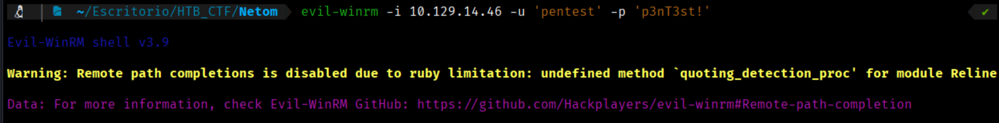
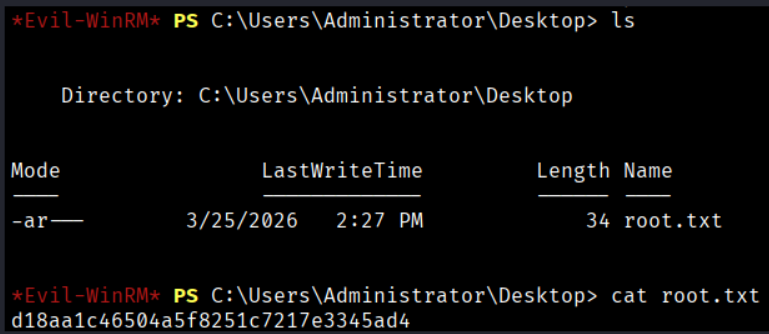

If we pay attention to the screen we have accessed, we notice that the system is running an **outdated version** and is requesting an upgrade. 

Currently, the system has **Installed Version 18.1.37.13946** of Paessler.



Let’s search on Google to see if there are any **vulnerabilities** in the version we have installed.



Well, now that we have identified the vulnerability, let's check if we can **reproduce this vulnerability** on our system. If we search deeply in Goolge, we find the following webpage that show us how to make the vulnerability https://codewatch.org/2018/06/25/prtg-18-2-39-command-injection-vulnerability/.

So we can go to Setup menu > Account Settings > Notifications. Then we click to “Add new notification” on the right menu.



Keep the default settings unchanged and navigate to the **"Execute Program"** section. Here, we can use this command to **add a user to the Administrators group**
```bash
$ test.txt;net user pentest p3nT3st! /add; net localgroup Administrators pentest /add
```
Make the following changes and click “Save”.



Next, on the far right of your notification name, click the **edit icon**, and then click the **bell icon** to trigger it.





Once done, use evil-winrm to login as the created admin user.
```bash
$ evil-winrm -i 10.129.14.46 -u 'pentest' -p 'p3nT3st!'  
```


Now we can found the root flag at Users\Administrator\Desktop



```bash
Root Flag -->d18aa1c46504a5f8251c7217e3345ad4
```


[Back](README.md)