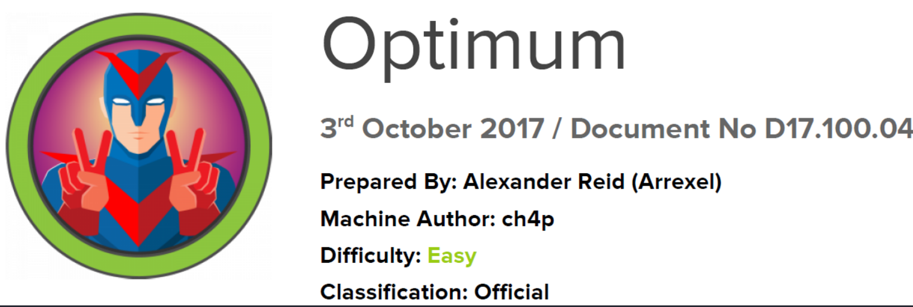

# Scope

Optimum is a beginner-level machine that primarily focuses on enumerating services with known vulnerabilities. Both exploits are easy to find and have corresponding Metasploit modules, making the machine relatively simple to complete.

# Index
- [Enumeration](Enumeration.md)
- [Exploitation](Exploitation.md)
- [Priv Escalation](Priv_Escalation.md)

Go back to [Hack-The-Box_CTF](https://github.com/jesuscuenca-cyber/Hack-The-Box_CTF)