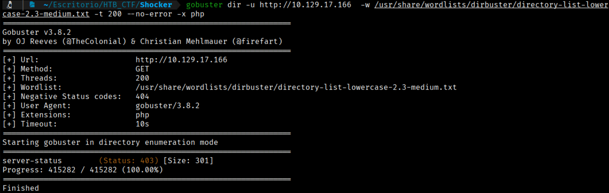
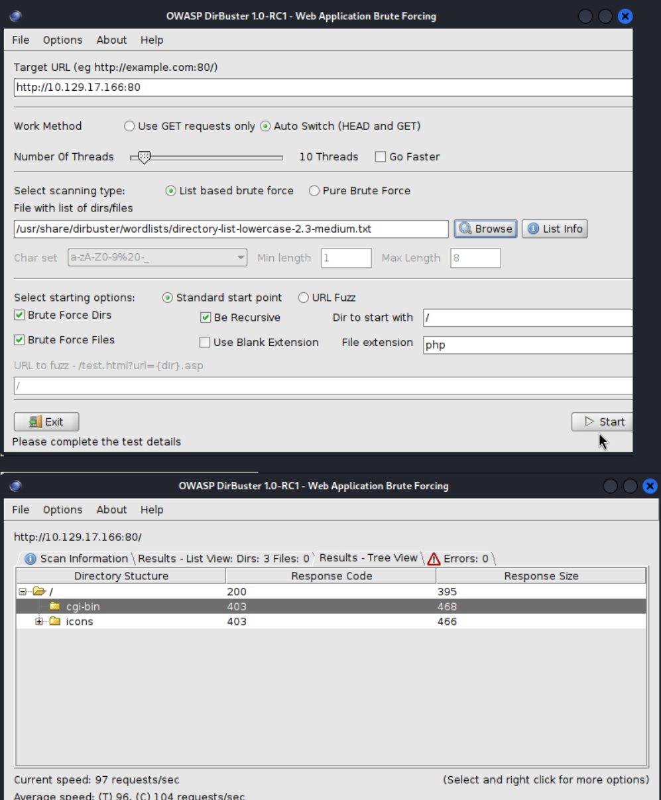
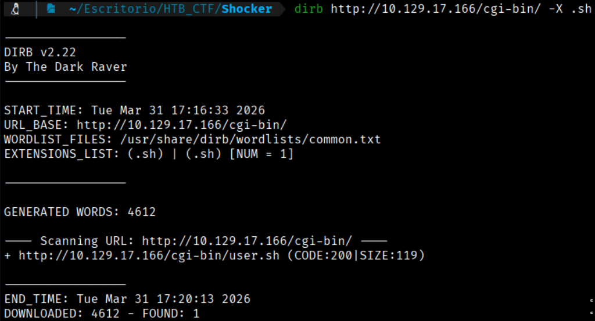
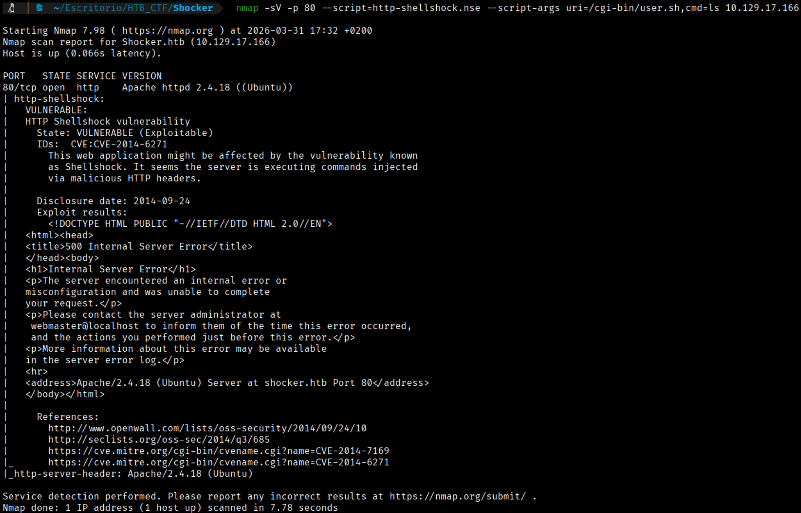
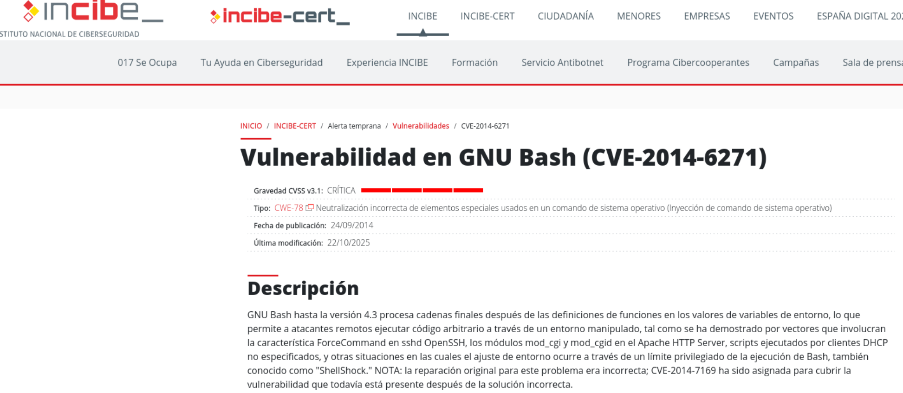

The Gobuster tool will allow us to scan for hidden resources such as subdomains, directories, and parameters.
Let's look for hidden subdomains. 
```bash
$ gobuster dir -u http://10.129.17.166  -w /usr/share/wordlists/dirbuster/directory-list-lowercase-2.3-medium.txt -t 200 --no-error -x php
 ```

- **`-t 200`** → Defines the number of simultaneous threads  
- **`--no-error`** → Filters out common error responses such as **404 Not Found** and **403 Forbidden**  
- **`-x php`** → Specifies the **file extensions** that will be automatically tested (e.g., `.php`) (becasuse thanks to wappalyzer we know that a php is runing in the website)



Llet's try to do an enumeration but with another tool, with Dirbuster to compare the results and to try to find more information.



We have found a CGI-BIN directory. The cgi-bin (Common Gateway Interface-binary) directory is a specific folder on a web server where executable scripts and programs are stored to produce dynamic content, such as forms, search features, or database interactions. It serves as a bridge between the server and the browser, and it has traditionally been used to host Perl, Python, or compiled binary scripts.

Seeing this directory, we are going to use Dirb (another fuzzing tool), but this time against the cgi-bin directory with extension .sh
```bash
$ dirb http://10.129.17.166/cgi-bin/ -X .sh
```



When we identify scripts, such as user.sh, that are executed through CGI, the first vulnerability that comes to mind is "Shellshock".

Shellshock, also known as Bashdoor, is a critical security vulnerability discovered in 2014 in the Unix Bash shell that allows attackers to execute arbitrary commands. By exploiting the way Bash handles environment variables, attackers can gain unauthorized access to web servers, IoT devices, and other internet-facing systems that rely on Bash to process requests.

### Key Aspects of the Shellshock Vulnerability

- **Target**: The vulnerability affects the Bash shell (Bourne Again Shell), a command-line interpreter widely used in Linux, Unix, and macOS systems.
- **Mechanism**: It originates from a flaw where Bash incorrectly executes additional code appended to specially crafted environment variables.
- **Impact**: Attackers can compromise vulnerable systems, such as web servers (through CGI scripts), to execute malicious commands, exfiltrate data, or build botnets.


To verify the vulnerability, we will use the Nmap Scripting Engine (NSE).
```bash
$ nmap -sV -p 80 --script=http-shellshock.nse --script-args uri=/cgi-bin/user.sh,cmd=ls 10.129.17.166
```

This Nmap command is used to test a web server for the Shellshock vulnerability.
 **nmap**: The network scanning tool being used.

-sV: Enables service version detection.
-p 80: Targets port 80 (HTTP).
--script=http-shellshock.nse: Executes an NSE script specifically designed to detect Shellshock.
--script-args uri=/cgi-bin/user.sh:
		uri=/cgi-bin/user.sh:  specifies the CGI script to test.
		cmd=ls:  attempts to run the command on the target if the vulnerability exists.
        10.129.17.166: The target machine‚ IP address.

If the system is vulnerable, the command may return the output of “ls” confirming that remote command execution is possible.



Now we are sure that the vulnerability (CVE-2014-6271) exist so we can establish a reverse comunication.




[Back](README.md)