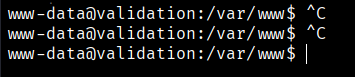
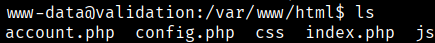
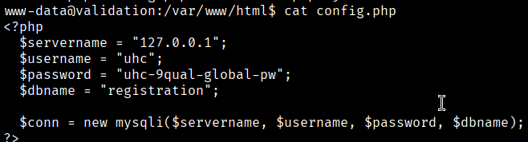
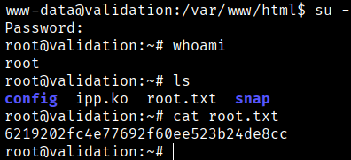

Next, we will perform TTY stabilization to ensure a fully interactive and functional shell and we will put crtl+c and crtl+l without problems
```bash
$ script /dev/null -c bash
ctrl+z
$ stty raw -echo; fg
$ reset xterm
$ export TERM=xterm
```



Our shell initially places us in the `/var/www/html/` directory, where we discover a `config.php` file.





The configuration file discloses a database password containing the string "global-pw". Since password reuse is a common misconfiguration, we attempt to use the retrieved password `uhc-9qualglobal-pw` to switch to the `root` user.
```bash
$ su -
```


```bash
Root Flag → 6219202fc4e77692f60ee523b24de8cc
```

[Back](README.md)