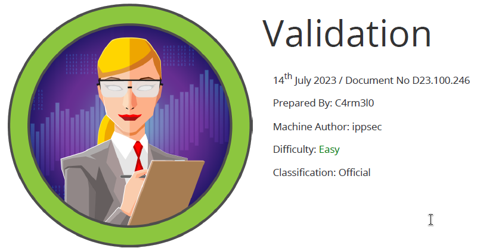

# Scope

Validation is an easy-level Linux machine that includes a web application vulnerable to a second-order SQL injection. By exploiting this flaw, an attacker can upload a web shell to the system, ultimately achieving Remote Code Execution (RCE). After gaining initial access, privilege escalation is performed by leveraging a reused database password, resulting in root-level control of the machine.

# Index
- [Enumeration](Enumeration.md)
- [Foothold](Foothold.md)
- [Priv Escalation](Priv_Escalation.md)

Go back to [Hack-The-Box_CTF](https://github.com/jesuscuenca-cyber/Hack-The-Box_CTF)